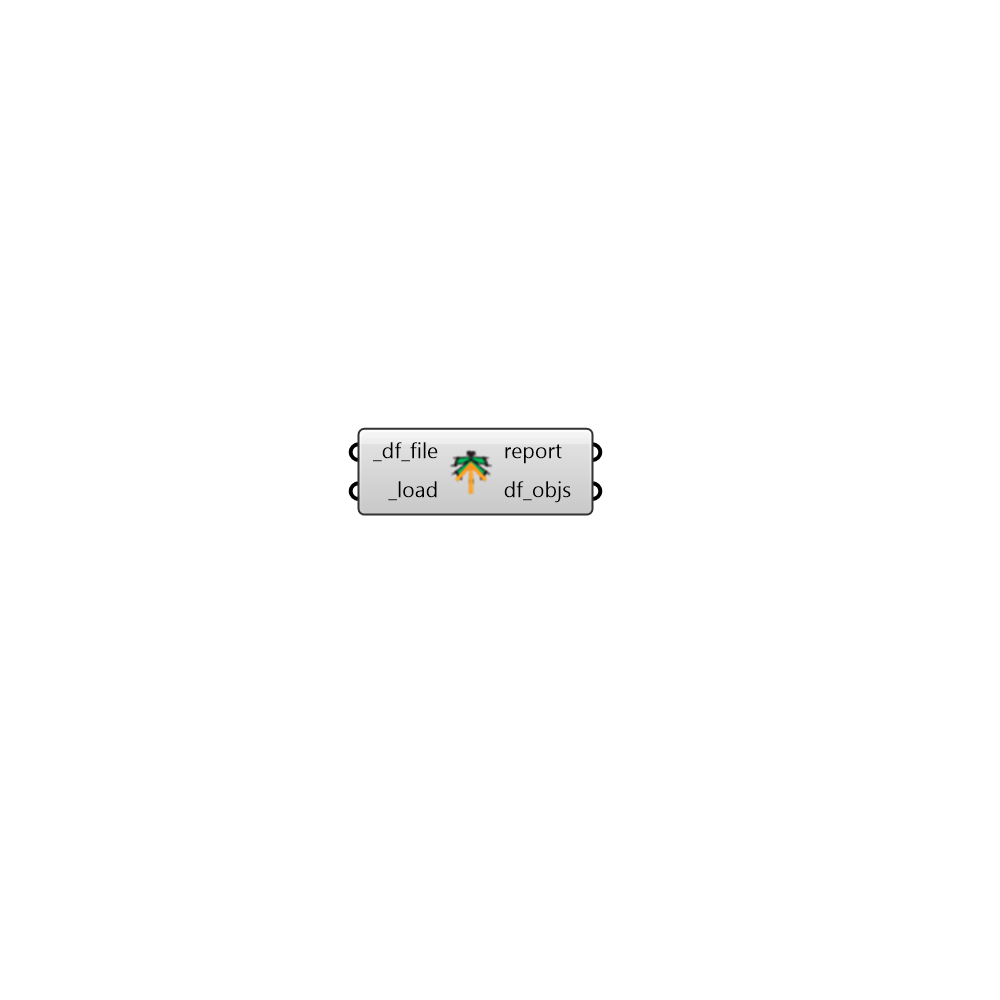

## Load Objects

 - [[source code]](https://github.com/ladybug-tools/dragonfly-grasshopper/blob/master/dragonfly_grasshopper/src//DF%20Load%20Objects.py)

Load any dragonfly object from a dragonfly JSON file 

This includes any Model, Building, Story, Room2D, WindowParameter, or ShadingParameter. 

It also includes any energy Material, Construction, ConstructionSet, Schedule,  Load, ProgramType, or Simulation object. 

#### Inputs
* ##### df_file [Required]
A file path to a dragonfly JSON from which objects will be loaded back into Grasshopper. The objects in the file must be non-abridged in order to be loaded back correctly. 
* ##### load [Required]
Set to "True to load the objects from the _df_file. 

#### Outputs
* ##### report
... 
* ##### df_objs
A list of dragonfly objects that have been re-serialized from the input file. 