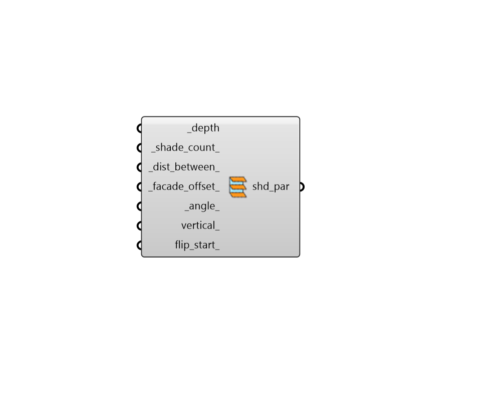

## Louver Parameters

 - [[source code]](https://github.com/ladybug-tools/dragonfly-grasshopper/blob/master/dragonfly_grasshopper/src//DF%20Louver%20Parameters.py)

Create Dragonfly shading parameters with instructions for a series of louvered Shades over a Wll. 

#### Inputs
* ##### depth [Required]
A number for the depth to extrude the louvers. 
* ##### shade_count 
A positive integer for the number of louvers to generate. Note that this input should be None if there is an input for _dist_between_. Default: 1. 
* ##### dist_between 
A number for the approximate distance between each louver. Note that this input should be None if there is an input for _shade_count_. 
* ##### facade_offset 
A number for the distance to louvers from the Wall. Default is 0 for no offset. 
* ##### angle 
A number for the for an angle to rotate the louvers in degrees. Default is 0 for no rotation. 
* ##### vertical 
Optional boolean to note whether the lovers are vertical. If False, the louvers will be horizontal. Default False. 
* ##### flip_start 
Boolean to note whether the side the louvers start from should be flipped. Default is False to have contours on top or right. Setting to True will start contours on the bottom or left. 

#### Outputs
* ##### shd_par
Shading Parameters that can be applied to a Dragonfly object using the "DF Apply Facade Parameters" component. 