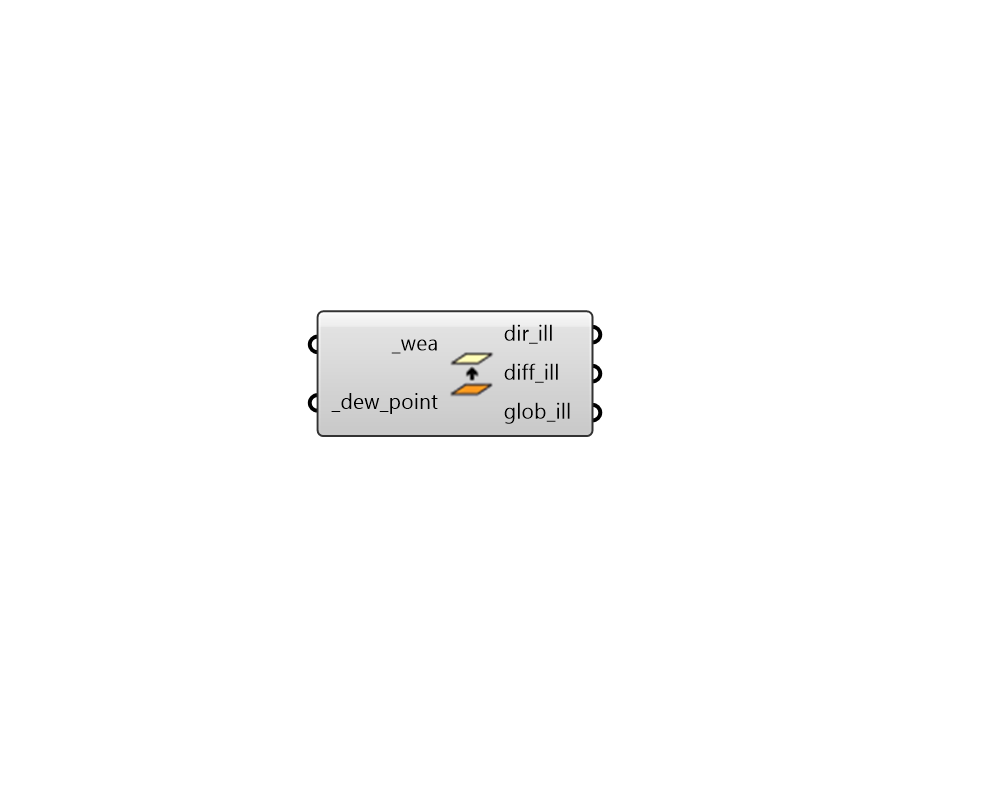

## Luminous Efficacy

 - [[source code]](https://github.com/ladybug-tools/dragonfly-grasshopper/blob/master/dragonfly_grasshopper/src//DF%20Luminous%20Efficacy.py)

Esimtate sky illuminance from the irradiance contained within a WEA object. 

#### Inputs
* ##### wea [Required]
A Ladybug WEA object. 
* ##### dew_point [Required]
An annual data collection representing dew point temperature [C]. 

#### Outputs
* ##### dir_ill
A data collection of direct normal illuminance values at each timestep of the WEA. 
* ##### diff_ill
A list of diffuse sky solar illuminance values at each timestep of the WEA. 
* ##### glob_ill
A list of global horizontal illuminance values at each timestep of the WEA. 