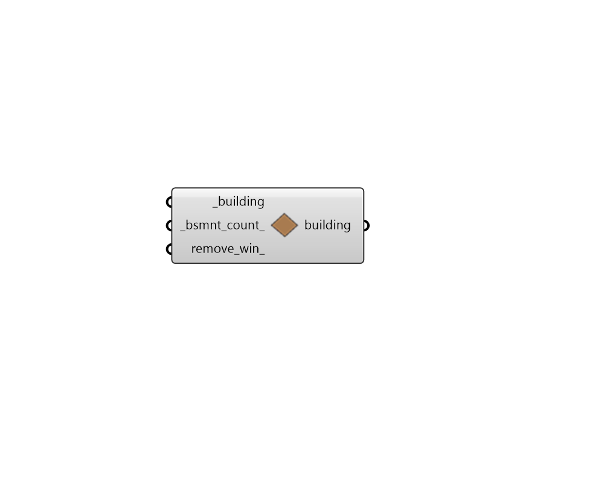

## Make Basements

 - [[source code]](https://github.com/ladybug-tools/dragonfly-grasshopper/blob/master/dragonfly_grasshopper/src//DF%20Make%20Basements.py)

Make the lowest unique Story(s) of a Building into basements. 

This involves setting the outdoor walls of the basement stories to have ground boundary conditions and setting the is_ground_contact property on all relevant Room2Ds that are a basement or have a basement story below them. 

#### Inputs
* ##### building [Required]
A Dragonfly Building that will have some if its stories set to be basements. This can also be an entire Dragonfly Model in which case all Buildings in the model will have their basements set. 
* ##### bsmnt_count 
A positive integer for the number of unique Stories on the Building to make into basements. (Default: 1). 
* ##### remove_win 
Boolean to note whether basement Room2D segments with windows should have their outdoor boundary conditions and windows kept (True) or whether the windows should be removed in order to assign a ground boundary condition to all walls (False). (Default: False). 

#### Outputs
* ##### building
The input Dragonfly object with the wall boundary conditions changed. 