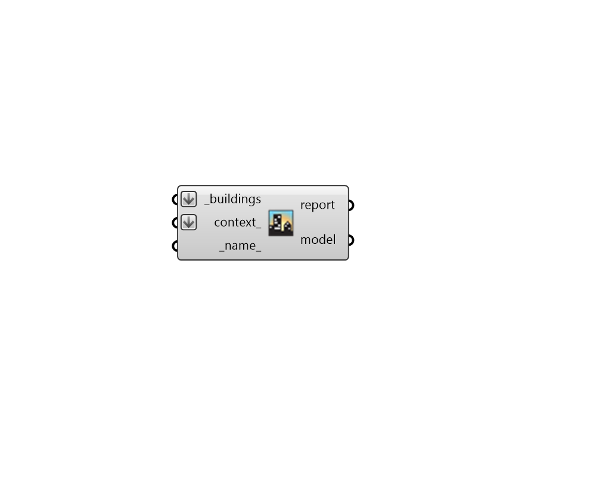

## Model

 - [[source code]](https://github.com/ladybug-tools/dragonfly-grasshopper/blob/master/dragonfly_grasshopper/src//DF%20Model.py)

Create a Dragonfly Model, which can be translated to Honeybee model and sent for simulation. 

#### Inputs
* ##### buildings [Required]
A list of Dragonfly Building objects to be added to the Model. Note that at least one Building is necessary to make a simulate-able energy model. 
* ##### context 
Optional Dragonfly ContextShade objects to be added to the Model. 
* ##### name 
Text to be used for the name and identifier of the Model. If no name is provided, it will be "unnamed". 

#### Outputs
* ##### report
Reports, errors, warnings, etc. 
* ##### model
A Dragonfly Model object possessing all of the input geometry objects. 