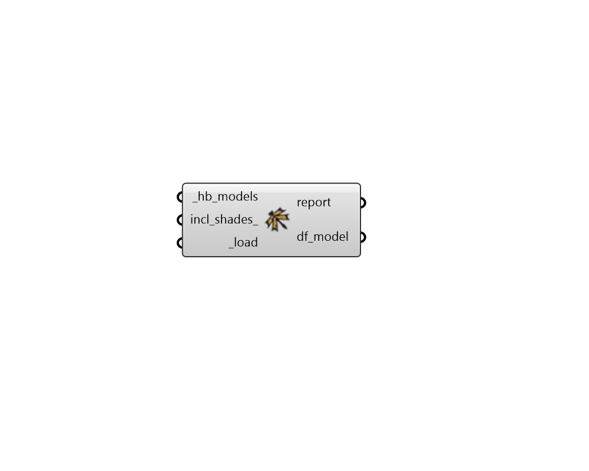

## Model From Honeybee

 - [[source code]](https://github.com/ladybug-tools/dragonfly-grasshopper/blob/master/dragonfly_grasshopper/src//DF%20Model%20From%20Honeybee.py)

Create a Dragonfly Model from a Honeybee Model. 

#### Inputs
* ##### hb_models [Required]
A Honeybee Model or list of Honeybee Models to be converted to a Dragonfly Model. 
* ##### incl_shades 
Boolean to note whether orphaned shades should be included as dragonfly ContextShades. (Default: False). 
* ##### load [Required]
Set to "True to load the objects from the _df_file. 

#### Outputs
* ##### report
... 
* ##### df_model
A list of dragonfly objects that have been re-serialized from the input file. 