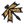

## Model From Honeybee

 - [[source code]](https://github.com/ladybug-tools/dragonfly-grasshopper/blob/master/dragonfly_grasshopper/src//DF%20Model%20From%20Honeybee.py)

Create a Dragonfly Model from a Honeybee Model. 

#### Inputs
* ##### hb_models [Required]
A Honeybee Model or list of Honeybee Models to be converted to a Dragonfly Model. 
* ##### all_3d_to_2d 
Boolean to note whether 3D Rooms should be converted into the Room2D format even when this means some loss or simplification of geometry (True). If False (the default), only the Honeybee Rooms that meet the criteria for translation to Room2D without loss of geometry will be converted and the other 3D Rooms that don't meet this criteria will be stored under the Dragonfly Building.room_3ds property in their original Honeybee format. (Default: False). 
* ##### incl_shades 
Boolean to note whether orphaned shades should be included as dragonfly ContextShades. (Default: False). 
* ##### load [Required]
Set to "True to load the objects from the _df_file. 

#### Outputs
* ##### report
... 
* ##### df_model
A list of dragonfly objects that have been re-serialized from the input file. 