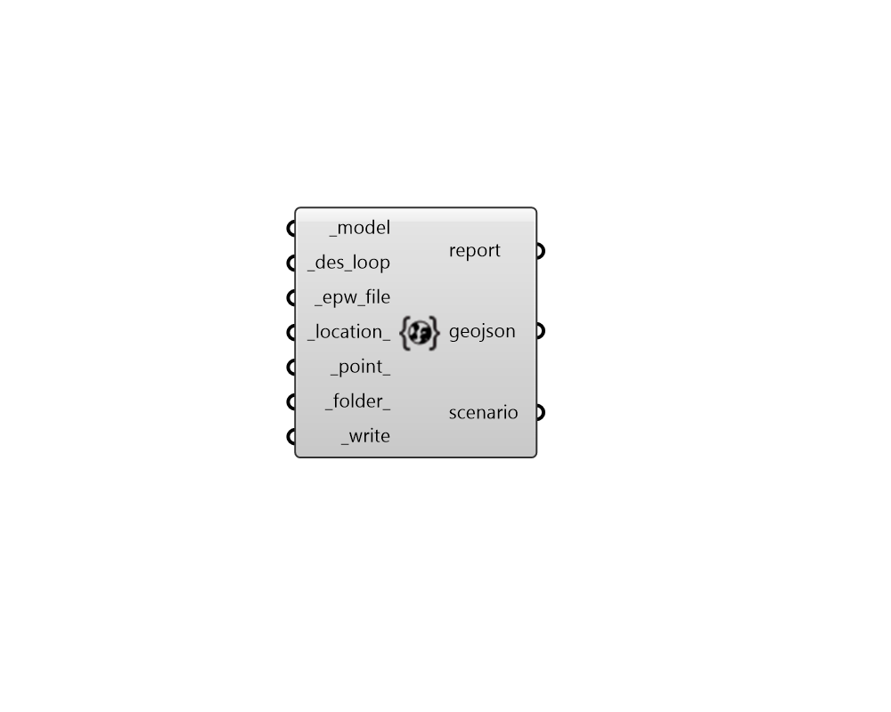

## Model To DES

 - [[source code]](https://github.com/ladybug-tools/dragonfly-grasshopper/blob/master/dragonfly_grasshopper/src//DF%20Model%20To%20DES.py)

Convert a Dragonfly Model into an URBANopt-compatible geoJSON and DES input files. 

This component is intended specifically for the case that District Energy System (DES) simulation is to be performed without using URBANopt to generate building energy loads through EnergyPlus. Accordingly, ALL Dragonfly Buildings in the Model must have DES loads assigned directly to them in order for this component to run correctly. 

#### Inputs
* ##### model [Required]
A Dragonfly Model object. 
* ##### des_loop [Required]
A District Energy System (DES) ThermalLoop that is associated with the dragonfly Model. 
* ##### epw_file [Required]
The file path to an EPW that should be associated with the output energy model. 
* ##### location 
A ladybug Location object possessing longitude and lattiude data used to position geoJSON file on the globe. 
* ##### point 
A Point for where the _location object exists within the space of the Rhino scene. This is used to posistion the geoJSON file on the globe. (Default: Rhino origin (0, 0, 0)). 
* ##### folder 
An optional folder to be used as the root of the URBANopt project folder. If None, the files will be written into a sub-directory of the default simulation folder. 
* ##### write [Required]
Set to "True" to have the Dragonfly Model translated to a geoJSON and other project folder files for District Energy System (DES) simulation. 

#### Outputs
* ##### report
Reports, errors, warnings, etc. 
* ##### geojson
The path to a geoJSON file that contains polygons for all of the Buildings within the dragonfly model along with any geometry of the District Energy System (DES). 
* ##### scenario
File path to the URBANopt scenario CSV that points to the building loads for DES simulation. This can be plugged into the "DF Write Modelica DES" component to create a full Modelica model of the DES. 