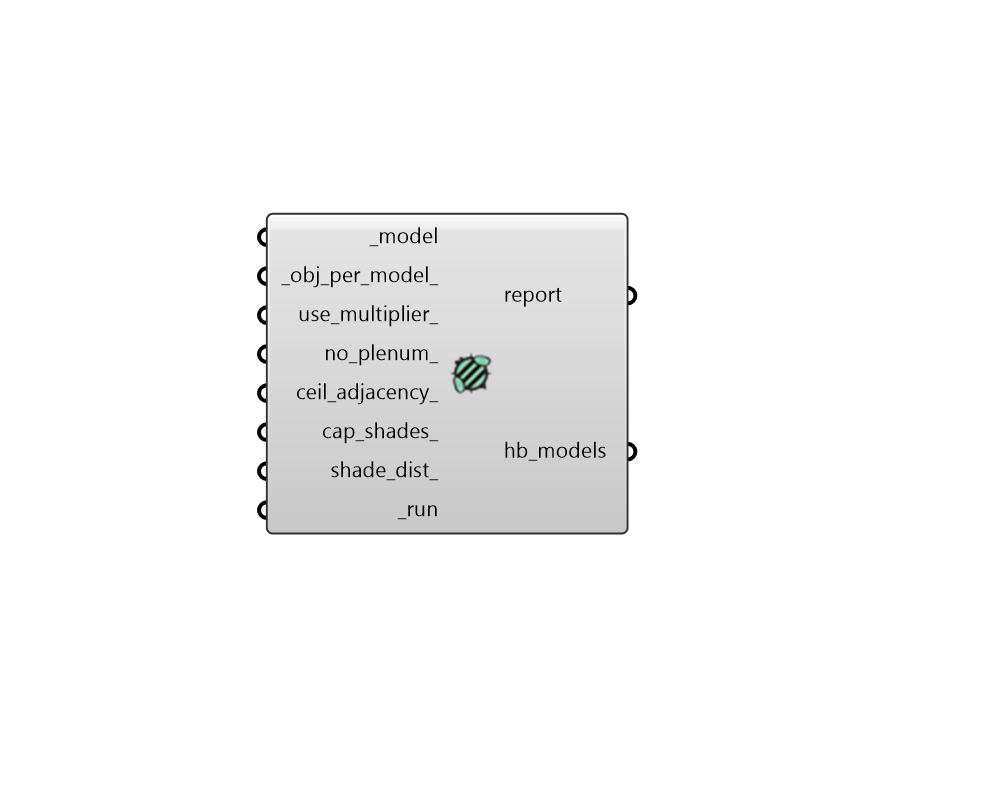

## Model To Honeybee

 - [[source code]](https://github.com/ladybug-tools/dragonfly-grasshopper/blob/master/dragonfly_grasshopper/src//DF%20Model%20To%20Honeybee.py)

Convert a Dragonfly Model into a series of Honeybee Models. 

#### Inputs
* ##### model [Required]
A Dragonfly Model object. 
* ##### obj_per_model 
Text to describe how the input Buildings should be divided across the output Models. Default: 'Building'. Choose from the following options: 

    * District - All buildings will be added to a single Honeybee Model.Such a Model can take a long time to simulate so this is only recommended for small numbers of buildings. 

    * Building - Each building will be exported into its own Model.For each Model, the other buildings input to this component will appear as context shade geometry. 

    * Story - Each Story of each Building will be exported into itsown Model. For each Honeybee Model, the other input Buildings will appear as context shade geometry as will all of the other stories of the same building. 
* ##### use_multiplier 
If True, the multipliers on each Building's Stories will be passed along to the generated Honeybee Room objects, indicating the simulation will be run once for each unique room and then results will be multiplied. If False, full geometry objects will be written for each and every story in the building such that all resulting multipliers will be 1. (Default: True). 
* ##### no_plenum 
Boolean to indicate whether ceiling/floor plenum depths assigned to Room2Ds should be ignored during translation. This results in each Room2D translating to a single Honeybee Room at the full floor-to-ceiling height instead of a base Room with (a) plenum Room(s). (Default: False). 
* ##### ceil_adjacency 
Boolean to note whether adjacencies should be solved between interior stories when Room2Ds perfectly match one another in their floor plate. This ensures that Surface boundary conditions are used instead of Adiabatic ones. Note that this input has no effect when the _obj_per_model_ is Story. (Default: False). 
* ##### merge_method 
An optional text string to describe how the Room2Ds should be merged into individual Rooms during the translation. Specifying a value here can be an effective way to reduce the number of Room volumes in the resulting 3D Honeybee Model and, ultimately, yield a faster simulation time in the destination engine with fewer results to manage. Note that Room2Ds will only be merged if they form a continuous volume. Otherwise, there will be multiple Rooms per zone or story, each with an integer added at the end of their identifiers and names. Choose from the following options: 

    * None - No merging of Room2Ds will occur

    * Zones - Room2Ds in the same zone will be merged

    * PlenumZones - Only plenums in the same zone will be merged

    * Stories - Rooms in the same story will be merged

    * PlenumStories - Only plenums in the same story will be merged
* ##### shade_dist 
An optional number to note the distance beyond which other buildings' shade should not be exported into a given Model. This is helpful for reducing the simulation run time of each Model when other connected buildings are too far away to have a meaningful impact on the results. If None, all other buildings will be included as context shade in each and every Model. Set to 0 to exclude all neighboring buildings from the resulting models. Default: None. 
* ##### run [Required]
Set to "True" to have the Dragonfly Model translated to a series of Honeybee Models. 

#### Outputs
* ##### report
Reports, errors, warnings, etc. 
* ##### hb_models
Honeybee Model objects derived from the input _models. These Models are ready to be simulated in either an Energy or Radiance simulation or they can be edited further with the Honeybee components. 