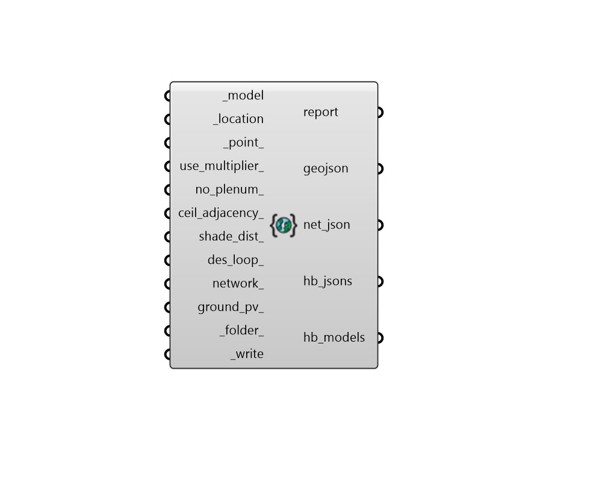

## Model To geoJSON

 - [[source code]](https://github.com/ladybug-tools/dragonfly-grasshopper/blob/master/dragonfly_grasshopper/src//DF%20Model%20To%20geoJSON.py)

Convert a Dragonfly Model into an URBANopt-compatible geoJSON with linked Honeybee Model JSONs. Honeybee Model JSONs will be referenced using the "detailed_model_filename" key in the geoJSON. 

#### Inputs
* ##### model [Required]
A Dragonfly Model object. 
* ##### location [Required]
A ladybug Location object possessing longitude and lattiude data used to position geoJSON file on the globe. 
* ##### point 
A Point for where the _location object exists within the space of the Rhino scene. This is used to posistion the geoJSON file on the globe. (Default: Rhino origin (0, 0, 0)). 
* ##### use_multiplier 
If True, the multipliers on each Building's Stories will be passed along to the generated Honeybee Room objects, indicating the simulation will be run once for each unique room and then results will be multiplied. If False, full geometry objects will be written for each and every story in the building such that all resulting multipliers will be 1. (Default: True). 
* ##### no_plenum 
Boolean to indicate whether ceiling/floor plenum depths assigned to Room2Ds should be ignored during translation. This results in each Room2D translating to a single Honeybee Room at the full floor-to-ceiling height instead of a base Room with (a) plenum Room(s). (Default: False). 
* ##### ceil_adjacency 
Boolean to note whether adjacencies should be solved between interior stories when Room2Ds perfectly match one another in their floor plate. This ensures that Surface boundary conditions are used instead of Adiabatic ones. (Default: False). 
* ##### shade_dist 
An optional number to note the distance beyond which other buildings' shade should not be exported into a given Model. This is helpful for reducing the simulation run time of each Model when other connected buildings are too far away to have a meaningful impact on the results. If None, all other buildings will be included as context shade in each and every Model. Set to 0 to exclude all neighboring buildings from the resulting models. Default: None. 
* ##### des_loop 
An optional District Energy System (DES) ThermalLoop that's associated with the dragonfly Model. 
* ##### network 
An optional OpenDSS ElectricalNetwork or RNM RoadNetwork that's associated with the input Dragonfly Model and will be written into the geoJSON. An input here is required to perform an OpenDSS or RNM simulation after running URBANopt. 
* ##### ground_pv 
An optional list of REopt GroundMountPV objects representing ground-mounted photovoltaic fields to be included in a REopt simulation after running URBANopt. 
* ##### folder 
Text for the full path to the folder where the geojson will be written along with all of the Honeybee Model JSONs. If None, the honeybee default simulation folder is used. 
* ##### write [Required]
Set to "True" to have the Dragonfly Model translated to an URBANopt- compatible geoJSON. This input can also be the integer "2", which will only create the geojson file but not create any honeybee Model json files that are linked to it (note that a geojson produced this way is not compatible with URBANopt). 

#### Outputs
* ##### report
Reports, errors, warnings, etc. 
* ##### geojson
The path to a geoJSON file that contains polygons for all of the Buildings within the dragonfly model along with their properties (floor area, number of stories, etc.). The polygons will also possess detailed_model_filename keys that align with where the Honeybee Model JSONs are written. 
* ##### net_json
A JSON file containing a representation of the electrical or street network. This can be loaded back to the original object using the "DF Load Objects" component. This will be None if no network_ is connected. 
* ##### hb_jsons
A list of file paths to honeybee Model JSONS that correspond to the detailed_model_filename keys in the geojson. 
* ##### hb_models
A list of honeybee Model objects that were generated in process of writing the URBANopt files. These can be visulazed using the components in the Honeybee 1 :: Visualize tab in order to verify that properties have been translated as expected. 