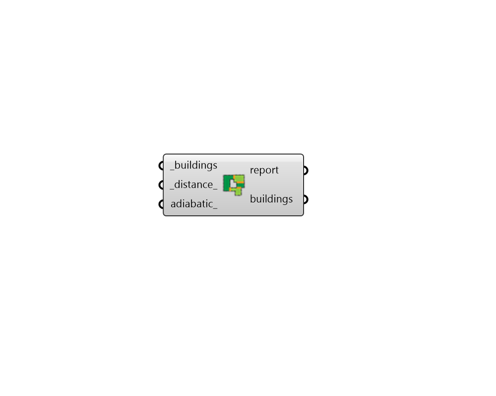

## Process Alleys

 - [[source code]](https://github.com/ladybug-tools/dragonfly-grasshopper/blob/master/dragonfly_grasshopper/src//DF%20Process%20Alleys.py)

Remove windows from any walls that are within a certain distance of other buildings. 

The component can also optionally set the boundary conditions of these walls to adiabatic. This is helpful when attempting to account for alleys or parti walls that may exist between buildings of a denser urban district. 

#### Inputs
* ##### buildings [Required]
Dragonfly Building objects which will have their windows removed if their walls lie within the distance of another building. This can also be an entire Dragonfly Model. 
* ##### distance 
A number for the maximum distance of an alleyway in Rhino model units. If a wall is closer to another Building than this distance, the windows will be removed. (Default: 1.0 meters). 
* ##### adiabatic 
A boolean to note whether the walls that have their windows removed should also receive an Adiabatic boundary condition. This is useful when the alleyways are more like parti walls than distinct pathways that someone could traverse. 

#### Outputs
* ##### report
Reports, errors, warnings, etc. 
* ##### buildings
The Building objects with their windows removed from any detected alleys. 