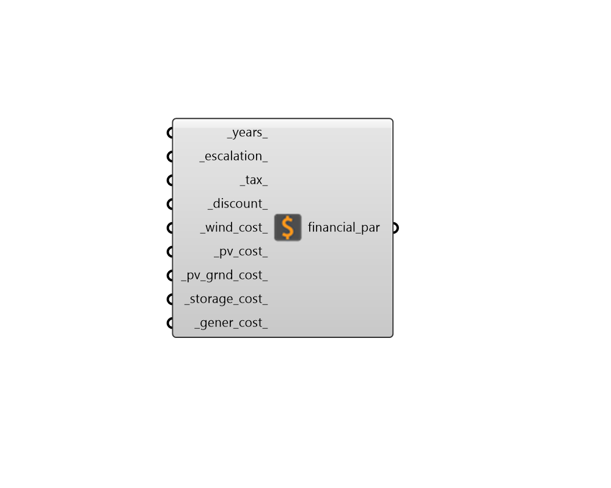

## REopt Financial Parameters

 - [[source code]](https://github.com/ladybug-tools/dragonfly-grasshopper/blob/master/dragonfly_grasshopper/src//DF%20REopt%20Financial%20Parameters.py)

Customize the financial settings of a REopt analysis. 

#### Inputs
* ##### years 
An integer for the number of years over which cost will be optimized. (Default: 25). 
* ##### escalation 
A number between 0 and 1 for the escalation rate over the analysis. (Default: 0.023). 
* ##### tax 
A number between 0 and 1 for the rate at which the owner/host of the system is taxed. (Default: 0.26). 
* ##### discount 
A number between 0 and 1 for the discount rate for the owner/host of the system. (Default: 0.083). 
* ##### wind_cost 
A number for the installation cost of wind power in US dollars per kW. (Default: 3013). 
* ##### pv_cost 
A number for the installation cost of photovoltaic power in US dollars per kW. (Default: 1600). 
* ##### pv_grnd_cost 
A number for the installation cost of photovoltaic power in US dollars per kW. (Default: 2200). 
* ##### storage_cost 
A number for the installation cost of power storage in US dollars per kW. (Default: 840). 
* ##### gener_cost 
A number for the installation cost of generators in US dollars per kW. (Default: 500). 

#### Outputs
* ##### financial_par
A REoptParameter object that can be plugged into the 'DF Run REopt' component. 