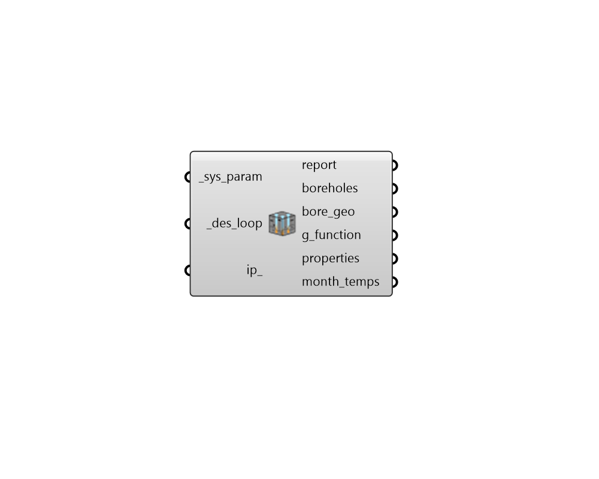

## Read GHE Sizing

 - [[source code]](https://github.com/ladybug-tools/dragonfly-grasshopper/blob/master/dragonfly_grasshopper/src//DF%20Read%20GHE%20Sizing.py)

Load properties of the Ground Heat Exchangers (GHEs) from the "DF Write Modelica DES" component. This includes the positions of boreholes in each GHE, the G-function of each GHE that describes the response of the ground to load, an a range of other properties output from the sizing simulation performed by GHEDesigner. 

#### Inputs
* ##### sys_param [Required]
The system parameters JSON file output by the "DF Write Modelica DES" component. This includes the detailed Building load profiles, equipment specifications, and borehole field characteristics. 
* ##### des_loop [Required]
The GHE Thermal Loop object output by the "DF GHE Thermal Loop", which contains the geometry of the district energy system. 
* ##### ip 
Boolean to note whether all outputs should be in SI or IP units. Setting this to True will result in all values in the report to IP and the month_temps will be in F instead of C. (Default: False). 

#### Outputs
* ##### report
Reports, errors, warnings, etc. 
* ##### boreholes
A list of points for the borehole locations within the _site. 
* ##### bore_geo
Script variable ColorNetAttr 
* ##### g_function
A data tree of G-function coefficients that describe the response of the ground to the input loads. Each pair of factors represents a point on the G-function. Flattening this data tree enables you to plug it directly into the "Ironbug Ground Heat Exchanger Vertical" component to simulate the ground heat exchanger in EnergyPlus. 
* ##### properties
A list of properties for the GHE that can be used to describe it in EnergyPlus simulations. The properties that can be plugged directly into the parameters of the "Ironbug Ground Heat Exchanger Vertical" component. The properties are in the following order: 

    * Borehole Length

    * Borehole Radius

    * Design Flow Rate

    * Ground Temperature

    * Ground Conductivity

    * Ground Heat Capacity

    * Grout Conductivity

    * Number of Boreholes

    * Pipe Outer Diameter

    * Pipe Conductivity

    * Pipe Thickness

    * U Tube Distance
* ##### month_temps
A list of ground temperatures in Celsius with one value for each month of the period over which the GHEDesigner simulation was run (typically 20 years). This can be connected to a nativ Grasshopper "Quick Graph" component and used to check the drift in the ground temperature over long periods of time. 