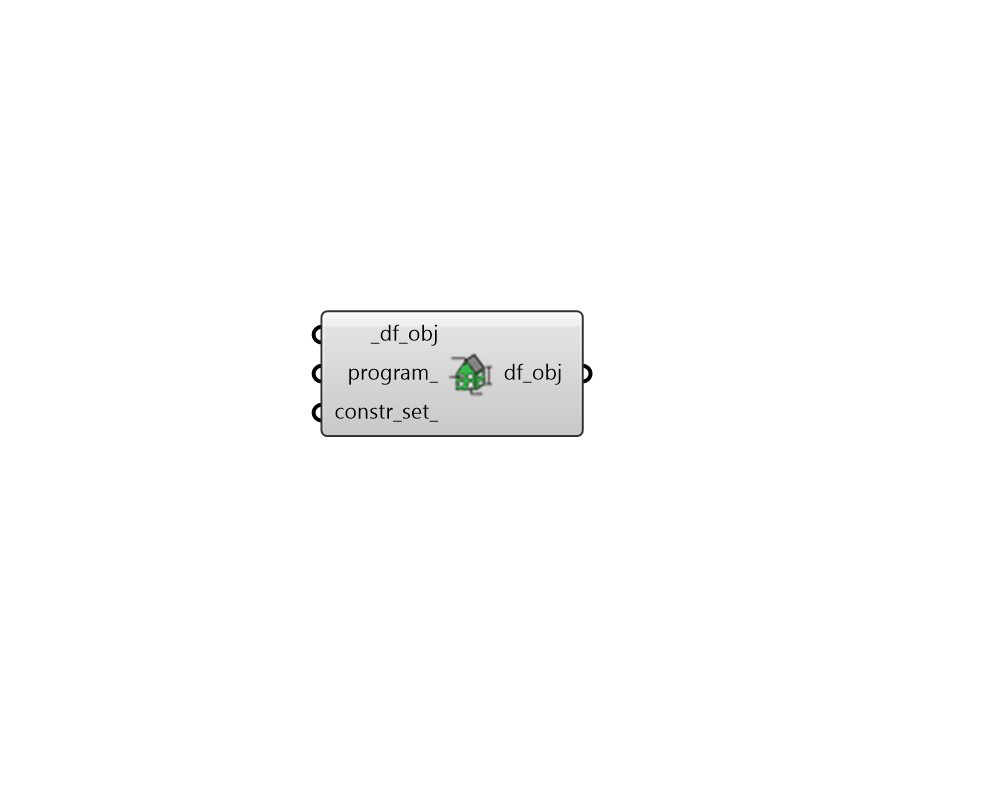

## Reassign Energy Properties

 - [[source code]](https://github.com/ladybug-tools/dragonfly-grasshopper/blob/master/dragonfly_grasshopper/src//DF%20Reassign%20Energy%20Properties.py)

Re-assign energy properties to any Dragonfly object (Building, Story, Room2D). 

This is useful for editing auto-generated child objects separately from their parent. For example, if you want to assign all of the ground floors of a given auto-generated Building to have a Retail ProgramType, this can help re-assign a Retail ProgramType to such stories. 

#### Inputs
* ##### df_obj [Required]
A Dragonfly Building, Story or Room2D which is to have its energy properties re-assigned. 
* ##### program 
Text to reassign the program of the input objects (to be looked up in the ProgramType library) such as that output from the "HB List Programs" component. This can also be a custom ProgramType object. 
* ##### constr_set 
Text to reassign construction set of the input objects, which is usedto assign all default energy constructions needed to create an energy model. Text should refer to a ConstructionSet within the library such as that output from the "HB List Construction Sets" component. This can also be a custom ConstructionSet object. 

#### Outputs
* ##### df_obj
The input Dragonfly object with its properties re-assigned based on the input. 