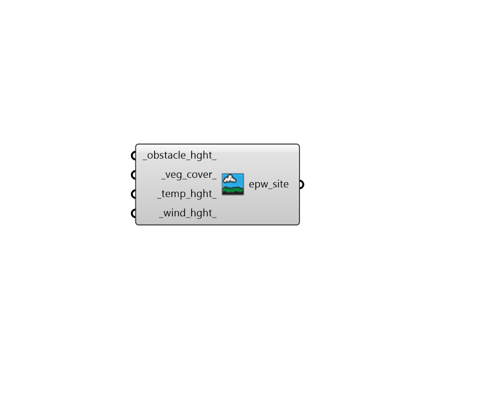

## Reference EPW Parameters

 - [[source code]](https://github.com/ladybug-tools/dragonfly-grasshopper/blob/master/dragonfly_grasshopper/src//DF%20Reference%20EPW%20Parameters.py)

Create Reference EPW Site parameters that represent the properties of the stie where rural EPW data was recorded for an Urban Weather Genrator (UWG) simulation. 

#### Inputs
* ##### obstacle_hght 
A number that represents the height in meters of objects that obstruct the view to the sky at the weather station site. This includes both trees and buildings. (Default: 0.1 m). 
* ##### veg_cover 
A number between 0 and 1 that represents the fraction of the  reference EPW site that is covered in grass. (Default: 0.9). 
* ##### temp_hght 
A number that represents the height in meters at which temperature is measured on the weather station. (Default: 10m, the standard measurement height for US DoE EPW files). 
* ##### wind_hght 
A number that represents the height in meters at which wind speed is measured on the weather station. (Default: 10m, the standard measurement height for US DoE EPW files). 

#### Outputs
* ##### epw_site
Reference EPW site parameters that can be plugged into the "DF UWG Simulation Parameter" component to specify the behavior of vegetation in the simulation. 