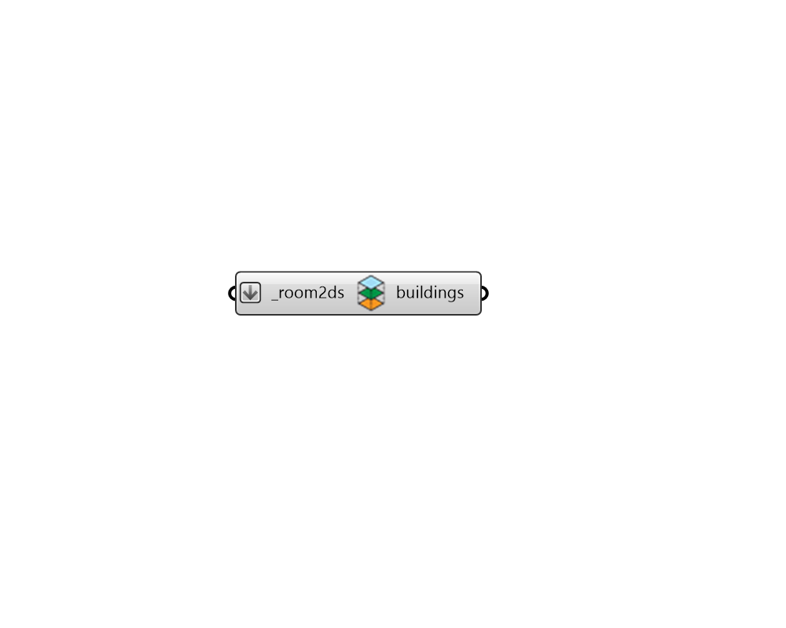

## Rejoin to Building

 - [[source code]](https://github.com/ladybug-tools/dragonfly-grasshopper/blob/master/dragonfly_grasshopper/src//DF%20Rejoin%20to%20Building.py)

Rejoin a list of Room2Ds that were originally a part of a Building back to a new Building with updated Room2Ds. 

In the event that the input contains Room2Ds that were not a part of an original Building, this component can still be used but the stories will be regenerated based on the Room2D floor elevations and a warning will be given. 

#### Inputs
* ##### room2ds [Required]
A list of Dragonfly Room2D objects to be re-joined into Buildings. 

#### Outputs
* ##### buildings
Dragonfly Buildings containing the input Room2Ds. This may be multiple buildings when the input Room2Ds originally had several different parent buildings. 