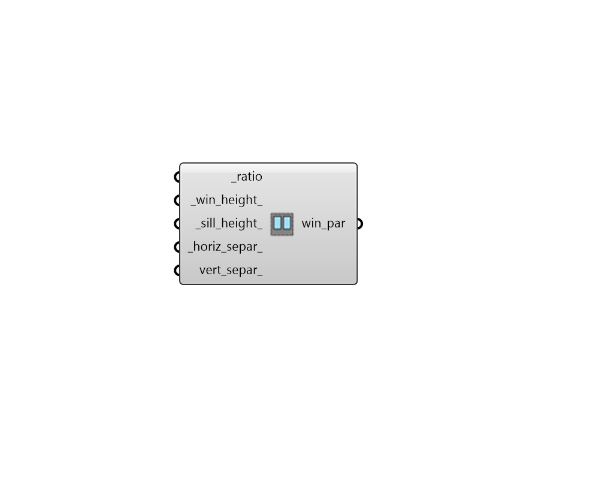

## Repeating Window Ratio Parameters

 - [[source code]](https://github.com/ladybug-tools/dragonfly-grasshopper/blob/master/dragonfly_grasshopper/src//DF%20Repeating%20Window%20Ratio%20Parameters.py)

Create Dragonfly window parameters with instructions for repeating windows derived from an area ratio with the base surface. 

#### Inputs
* ##### ratio [Required]
A number between 0 and 0.95 for the ratio between the area of the apertures and the area of the parent face. If an array of values are input here, different ratios will be assigned based on cardinal direction, starting with north and moving clockwise. 
* ##### win_height 
A number for the target height of the output apertures. Note that, if the ratio is too large for the height, the ratio will take precedence and the actual aperture height will be larger than this value. If an array of values are input here, different heights will be assigned based on cardinal direction, starting with north and moving clockwise. Default: 2 meters. 
* ##### sill_height 
A number for the target height above the bottom edge of the face to start the apertures. Note that, if the ratio is too large for the height, the ratio will take precedence and the sill_height will be smaller than this value. If an array of values are input here, different heights will be assigned based on cardinal direction, starting with north and moving clockwise. Default: 0.8 meters. 
* ##### horiz_separ 
A number for the horizontal separation between individual aperture centerlines.  If this number is larger than the parent face's length, only one aperture will be produced. If an array of values are input here, different separation distances will be assigned based on cardinal direction, starting with north and moving clockwise. Default: 3 meters. 
* ##### vert_separ 
An optional number to create a single vertical separation between top and bottom apertures. If an array of values are input here, different separation distances will be assigned based on cardinal direction, starting with north and moving clockwise. 

#### Outputs
* ##### win_par
Window Parameters that can be applied to a Dragonfly object using the "DF Apply Facade Parameters" component. 