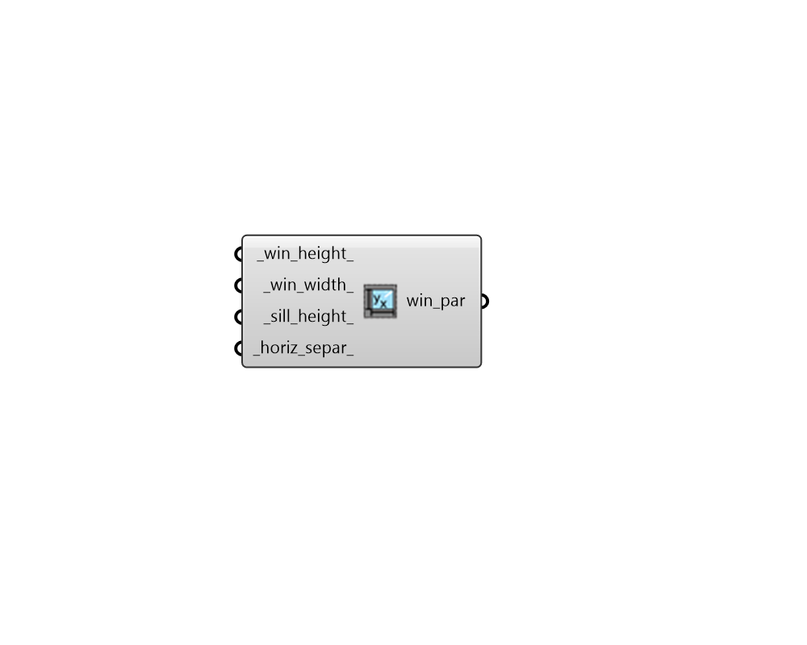

## Repeating Window Width Height Parameters

 - [[source code]](https://github.com/ladybug-tools/dragonfly-grasshopper/blob/master/dragonfly_grasshopper/src//DF%20Repeating%20Window%20Width%20Height%20Parameters.py)

Create Dragonfly window parameters with instructions for repeating rectangular windows of a fixed width and height. 

This effectively fills a wall with windows at the specified width, height and separation. 

#### Inputs
* ##### win_height 
A number for the target height of the windows. Note that, if the window_height is larger than the height of the wall, the generated windows will have a height equal to the wall height in order to avoid having windows extend outside the wall face. (Default: 2 meters). 
* ##### win_width 
A number for the target width of the windows. Note that, if the window_width is larger than the width of the wall, the generated windows will have a width equal to the wall width in order to avoid having windows extend outside the wall face. (Default: 1.5 meters). 
* ##### sill_height 
A number for the target height above the bottom edge of the face to start the apertures. Note that, if the window height is too large to acoomodate the sill height input here, the window height will take precedence and the sill height will be smaller than this value. (Default: 0.8 meters). 
* ##### horiz_separ 
A number for the horizontal separation between individual aperture centerlines.  If this number is larger than the parent face's length, only one aperture will be produced. (Default: 3 meters). 

#### Outputs
* ##### win_par
Window Parameters that can be applied to a Dragonfly object using the "DF Apply Facade Parameters" component. 