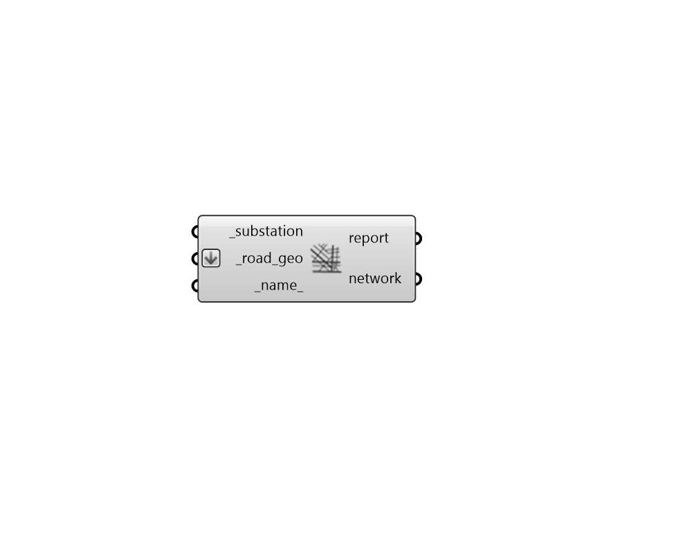

## Road Network

 - [[source code]](https://github.com/ladybug-tools/dragonfly-grasshopper/blob/master/dragonfly_grasshopper/src//DF%20Road%20Network.py)

Create an RNM Road Network, which represents the streets along which electrical infrastructure will be placed by RNM. 

This includes a substation and road geometries running between the buildings. 

#### Inputs
* ##### substation [Required]
A Substation object representing the electrical substation supplying the network with electricity. 
* ##### road_geo [Required]
An array of Lines or Polylines that represent the roads within the network. 
* ##### name 
Text to be used for the name and identifier of the Road Newtork. If no name is provided, it will be "unnamed". 

#### Outputs
* ##### report
Reports, errors, warnings, etc. 
* ##### network
A Dragonfly Road Newtork object possessing all roads needed for an RNM simulation. This should be connected to the network_ input of the "DF Model to GeoJSON" component. 