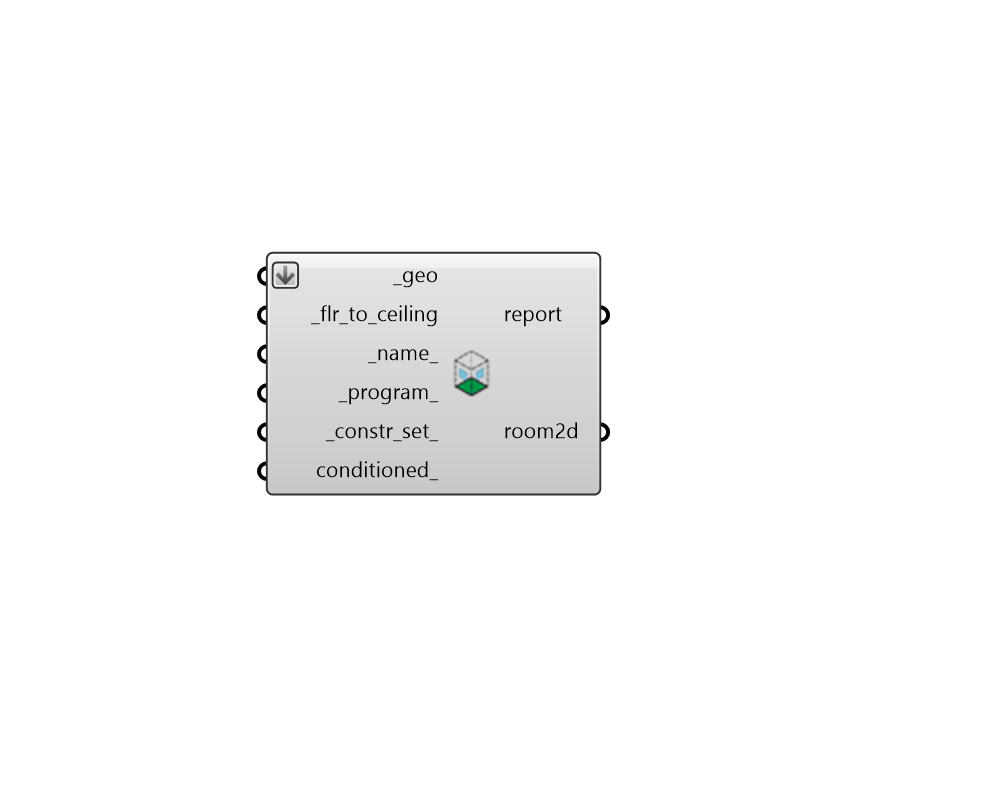

## Room2D

 - [[source code]](https://github.com/ladybug-tools/dragonfly-grasshopper/blob/master/dragonfly_grasshopper/src//DF%20Room2D.py)

Create Dragonfly Room2Ds from floor plate geometry (horizontal Rhino surfaces). 

#### Inputs
* ##### geo [Required]
A list of horizontal Rhino surfaces or closed planar polylines representing floor plates to be converted into Room2Ds. 
* ##### flr_to_ceiling [Required]
A number for the height above the floor where the ceiling begins. Typical values range from 3 to 5 meters. 
* ##### name 
Text to set the base name for the Room2D, which will also be incorporated into unique Room2D identifier. This will be combined with the index of each input _footprint_geo to yield a unique name for each output Room2D. If the name is not provided, a random one will be assigned. 
* ##### program 
Text for the program of the Room2Ds (to be looked up in the ProgramType library) such as that output from the "HB List Programs" component. This can also be a custom ProgramType object. If no program is input here, the Room2Ds will have a generic office program. 
* ##### constr_set 
Text for the construction set of the Room2Ds, which is used to assign all default energy constructions needed to create an energy model. Text should refer to a ConstructionSet within the library such as that output from the "HB List Construction Sets" component. This can also be a custom ConstructionSet object. If nothing is input here, the Room2Ds will have a generic construction set that is not sensitive to the Room2Ds's climate or building energy code. 
* ##### conditioned 
Boolean to note whether the Room2Ds have heating and cooling systems. 

#### Outputs
* ##### report
Reports, errors, warnings, etc. 
* ##### room2d
Dragonfly Room2Ds. 