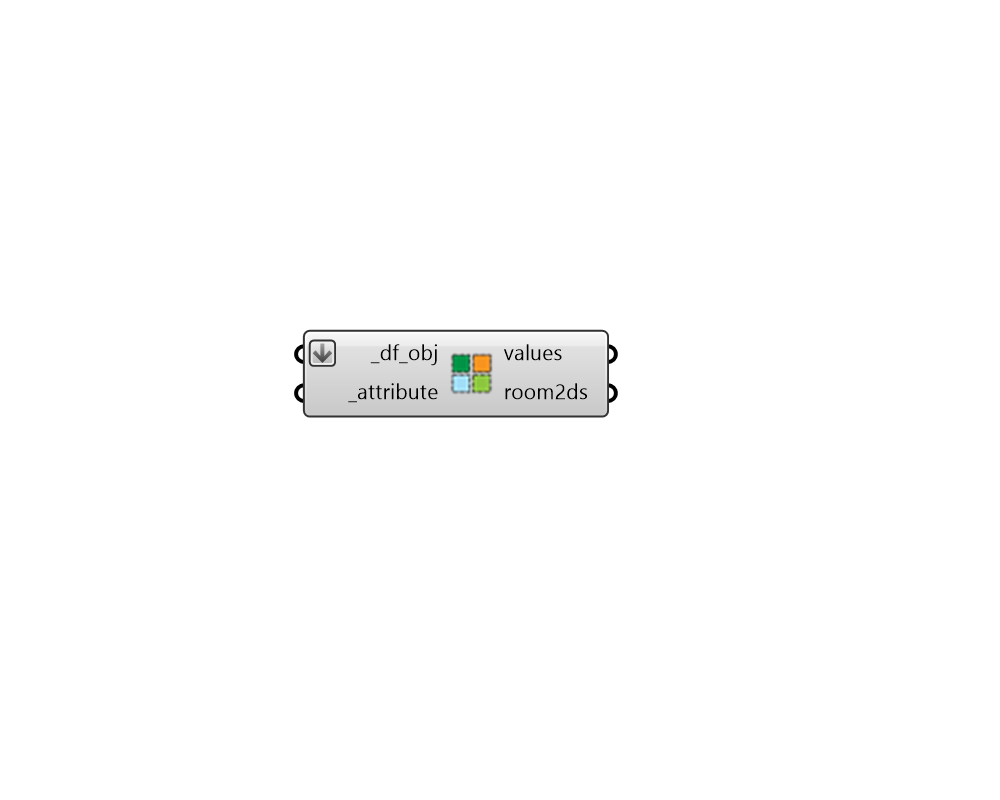

## Room2Ds by Attribute

 - [[source code]](https://github.com/ladybug-tools/dragonfly-grasshopper/blob/master/dragonfly_grasshopper/src//DF%20Room2Ds%20by%20Attribute.py)

Separate and group dragonfly Room2Ds by any attribute that the room possesses. 

This can be used to group Room2Ds by program, whether rooms are conditioned, etc. 

#### Inputs
* ##### df_obj [Required]
A Dragonfly Model, Building, Story or Room2D to be separated and grouped based on room attributes. 
* ##### attribute [Required]
Text for the name of the Room2D attribute by which the Room2Ds should be separated. The "DF Room2D Attributes" component lists all of the attributes of the Room2D. 

#### Outputs
* ##### values
A list of values with one attribute value for each branch of the output rooms. 
* ##### room2ds
A data tree of honeybee rooms with each branch of the tree representing a different attribute value. 