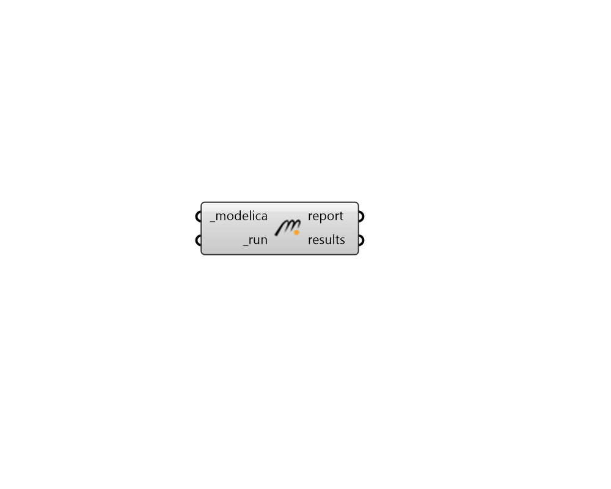

## Run Modelica

 - [[source code]](https://github.com/ladybug-tools/dragonfly-grasshopper/blob/master/dragonfly_grasshopper/src//DF%20Run%20Modelica.py)

Run a Modelica District Energy System (DES) through an annual simulation using OpenModelica inside a Docker image (via Docker Desktop). 

Docker Dekstop can be downloaded at the following link: https://www.docker.com/products/docker-desktop/ 

#### Inputs
* ##### modelica [Required]
A folder where all of the Modelica files of the District Energy System (DES) are written. These Modelica files can be created using the "DF Write Modelica DES" component. 
* ##### run [Required]
Script variable Python 

#### Outputs
* ##### report
Reports, errors, warnings, etc. 
* ##### results
A folder containing the results of the Modelica simulation. 