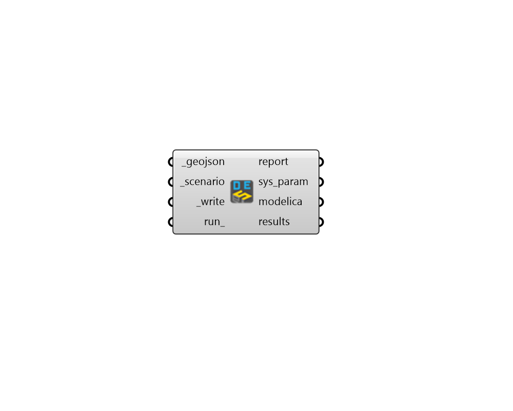

## Run Modelica DES

 - [[source code]](https://github.com/ladybug-tools/dragonfly-grasshopper/blob/master/dragonfly_grasshopper/src//DF%20Run%20Modelica%20DES.py)

Run a an URBANopt geoJSON and scenario through Modelica Distric Energy System (DES) simulation. 

The geoJSON must have a valid DES Loop assigned to it in order to run correctly through Modelica DES simulation. 

#### Inputs
* ##### geojson [Required]
The path to an URBANopt-compatible geoJSON file. This geoJSON file can be obtained form the "DF Model to geoJSON" component. The geoJSON must have a valid District Energy System (DES) Loop assigned to it in order to run correctly through the DES simulation. 
* ##### scenario [Required]
The path to an URBANopt .csv file for the scenario. This CSV file can be obtained form the "DF Run URBANopt" component. 
* ##### write [Required]
Set to "True" to run the component, install any missing dependencies, and write the Modelica files for the Distric Energy System. 
* ##### run 
Set to "True" to translate the Modelica files to a Functional Mockup Unit (FMU) and then simulate the FMU. This will ensure that all result files appear in their respective outputs from this component. 

#### Outputs
* ##### report
Reports, errors, warnings, etc. 
* ##### sys_param
A JSON file containing all of the specifications of the District Energy System, including the detailed Building load profiles. 
* ##### modelica
A folder where all of the Modelica files of the District Energy System (DES) are written. 
* ##### results
A folder containing the results of the Modelica simulation if run_ is True and the simulation is successful. 