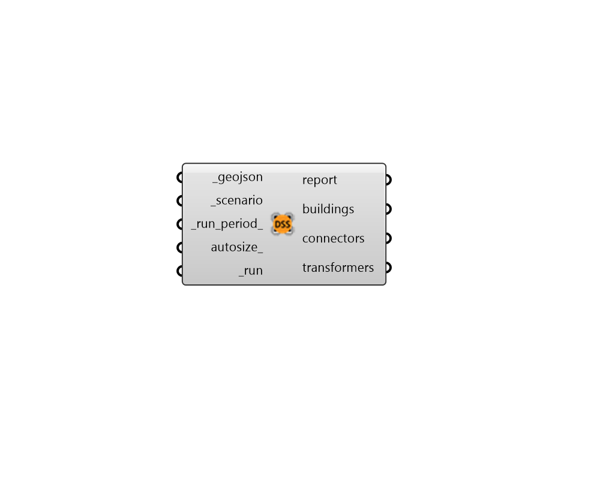

## Run OpenDSS

 - [[source code]](https://github.com/ladybug-tools/dragonfly-grasshopper/blob/master/dragonfly_grasshopper/src//DF%20Run%20OpenDSS.py)

Run a an URBANopt geoJSON and scenario through OpenDSS. 

The geoJSON must have a valid Electrical Network assigned to it in order to run correctly through OpenDSS. 

This component also requires the urbanopt-ditto-reader to be installed. The urbanopt-ditto-reader can be installed by installing Python 3.7 and then running the following from command line; 

pip install urbanopt-ditto-reader==0.3.8 

#### Inputs
* ##### geojson [Required]
The path to an URBANopt-compatible geoJSON file. This geoJSON file can be obtained form the "DF Model to geoJSON" component. The geoJSON must have a valid Electrical Network assigned to it in order to run correctly through OpenDSS. 
* ##### scenario [Required]
The path to an URBANopt .csv file for the scenario. This CSV file can be obtained form the "DF Run URBANopt" component. 
* ##### run_period 
A ladybyg AnalysisPeriod object to describe the time period over which to run the simulation. The default is to run the simulation for the whole EnergyPlus run period. 
* ##### run [Required]
Set to "True" to run the geojson and scenario through OpenDSS. 

#### Outputs
* ##### report
Reports, errors, warnings, etc. 
* ##### buildings
A list of CSV files containing the voltage and over/under voltage results of the simulation at each timestep. There is one CSV per building in the dragonfly model. These can be imported with the "DF Read OpenDSS Result" component. 
* ##### connectors
A list of CSV result files containing the power line loading and overloading results of the simulation at each timestep. There is one CSV per electrical connector in the network. These can be imported with the "DF Read OpenDSS Result" component. 
* ##### transformers
A list of CSV result files containing the transformer loading and overloading results of the simulation at each timestep. There is one CSV per transformer in the network. These can be imported with the "DF Read OpenDSS Result" component. 