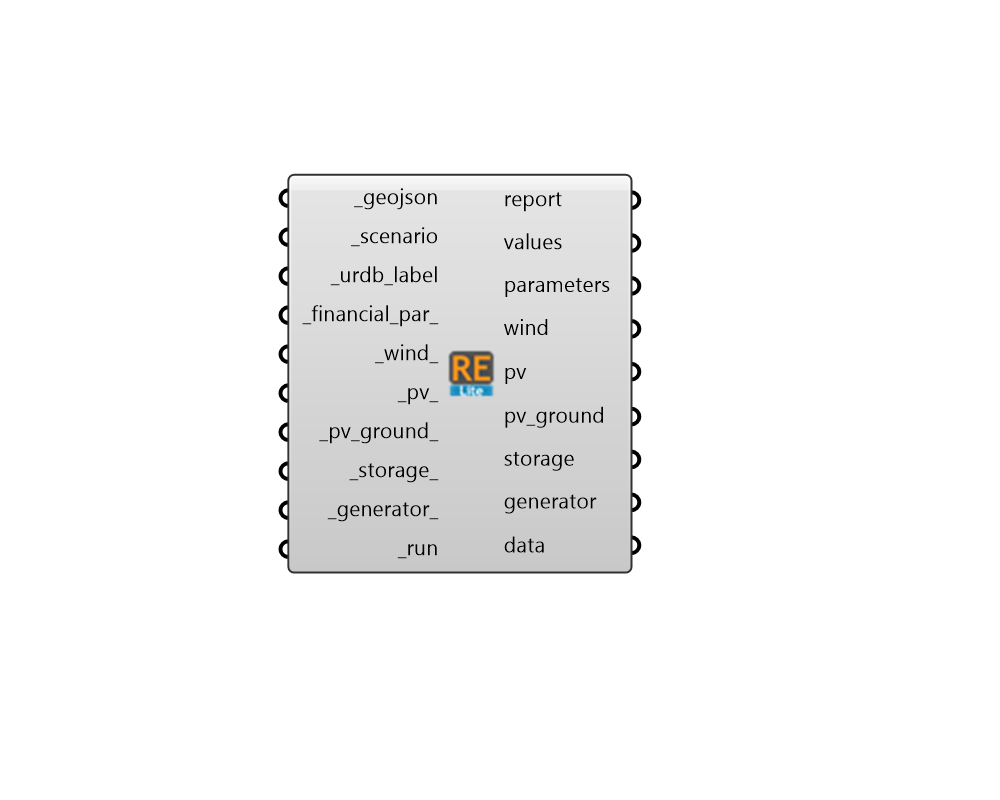

## Run REopt

 - [[source code]](https://github.com/ladybug-tools/dragonfly-grasshopper/blob/master/dragonfly_grasshopper/src//DF%20Run%20REopt.py)

Run a an URBANopt geoJSON and scenario through REopt using the URBANopt CLI. 

This component requires the URBANopt CLI to be installed in order to run. Installation instructions for the URBANopt CLI can be found at: https://docs.urbanopt.net/installation/installation.html 

#### Inputs
* ##### geojson [Required]
The path to an URBANopt-compatible geoJSON file. This geoJSON file can be obtained form the "DF Model to geoJSON" component. 
* ##### scenario [Required]
The path to an URBANopt .csv file for the scenario. This CSV file can be obtained form the "DF Run URBANopt" component. 
* ##### urdb_label [Required]
Text string for the Utility Rate Database (URDB) label for the particular electrical utility rate for the optimization. The label is the last term of the URL of a utility rate detail page (eg. the urdb label at https://openei.org/apps/IURDB/rate/view/5b0d83af5457a3f276733305 is 5b0d83af5457a3f276733305). Utility rates for specific locations can be looked up in the REopt Lite tool (https://reopt.nrel.gov/tool) and the label can be obtained by clicking on "Rate Details" link for a particular selected rate. 
* ##### financial_par 
A REoptParameter object to describe the financial assumptions of the REopt analysis. This can be obtained from the "DF REopt Financial Parameters" component. If None, some default parameters will be generated for a typical analysis. (Default: None). 
* ##### wind 
A number for the maximum installed kilowatts of wind power. (Default: 0). 
* ##### pv 
A number for the maximum installed kilowatts of roof-mounted photovoltaic power. (Default: 1000000000). 
* ##### pv_ground 
A number for the maximum installed kilowatts of ground-mounted photovoltaic power. (Default: 1000000000). 
* ##### storage 
A number for the maximum installed kilowatts of electrical storage. (Default: 1000000). 
* ##### generator 
A number for the maximum installed kilowatts of generator power. Note that generators are only used in outages. (Default: 1000000000). 
* ##### run [Required]
Set to "True" to run the geojson and scenario through REopt. This will ensure that all result files appear in their respective outputs from this component. 

#### Outputs
* ##### report
Reports, errors, warnings, etc. 
* ##### values
A list of numerical values from the REopt analysis, all related to the cost and financial outcome of the optimization. These values align with the parameters below. 
* ##### parameters
A list of text that correspond to the numerical values above. Each text item explains what the numerical value means. 
* ##### wind
A number for the optimal capacity of wind power that should be installed in kW. This will be null unless a non-zero value is specified for the input _wind_. 
* ##### pv
A number for the optimal capacity of roof-mounted photovlotaic power that should be installed in kW. 
* ##### pv_ground
A number for the optimal capacity of ground-mounted photovlotaic power that should be installed in kW. 
* ##### storage
A list of two numbers ordered as follows. 

    - A number for the optimal dicharge capacity of battery storagethat should be installed in kW. 

    - A number for the optimal total capacity of battery storagethat should be installed in kWh. 
* ##### generator
A number for the optimal capacity of generator power that should be installed in kW. This will be null unless a non-zero value is specified for the input _generator_. 
* ##### data
A list of hourly continuous data collections containing the detailed timeseties results of the REopt analysis. 