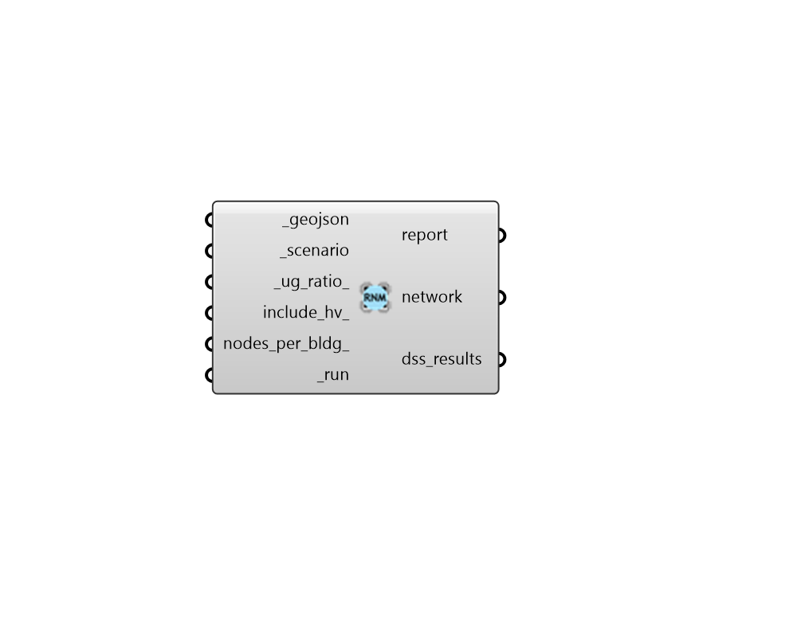

## Run RNM

 - [[source code]](https://github.com/ladybug-tools/dragonfly-grasshopper/blob/master/dragonfly_grasshopper/src//DF%20Run%20RNM.py)

Run a an URBANopt geoJSON and scenario through RNM. 

The geoJSON must have a valid Road Network assigned to it in order to run correctly through RNM. 

#### Inputs
* ##### geojson [Required]
The path to an URBANopt-compatible geoJSON file. This geoJSON file can be obtained form the "DF Model to geoJSON" component. The geoJSON must have a valid Road Network assigned to it in order to run correctly through RNM. 
* ##### scenario [Required]
The path to an URBANopt .csv file for the scenario. This CSV file can be obtained form the "DF Run URBANopt" component. 
* ##### ug_ratio 
A number between 0 and 1 for the ratio of overall cables that are underground vs. overhead in the analysis. (Default: 0.9). 
* ##### include_hv 
A boolean to note whether high voltage consumers should be included in the analysis. (Default: False). 
* ##### nodes_per_bldg 
A positive integer for the maximum number of low voltage nodes to represent a single building. (Default: 1). 
* ##### run [Required]
Set to "True" to run the geojson and scenario through RNM. 

#### Outputs
* ##### report
Reports, errors, warnings, etc. 
* ##### network
The ElectricalNetwork object output from the RNM simulation. The properties of this object can be visualized with the "DF Color Network Attributes" component. However, the network can not be used for OpenDSS simulation (the dss_files below should be used for this purpose). 
* ##### dss_results
Path to the folder containing all of the OpenDSS files. 