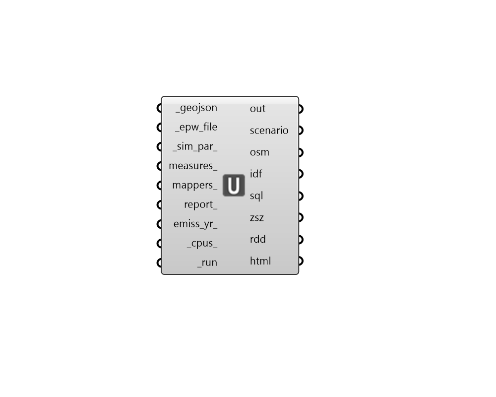

## Run URBANopt

 - [[source code]](https://github.com/ladybug-tools/dragonfly-grasshopper/blob/master/dragonfly_grasshopper/src//DF%20Run%20URBANopt.py)

Run an URBANopt geoJSON through EnergyPlus using the URBANopt CLI. 

This component requires the URBANopt CLI to be installed in order to run. Installation instructions for the URBANopt CLI can be found at: https://docs.urbanopt.net/installation/installation.html 

#### Inputs
* ##### geojson [Required]
The path to an URBANopt-compatible geoJSON file. This geoJSON file can be obtained form the "DF Model to geoJSON" component. 
* ##### epw_file [Required]
Path to an .epw file on this computer as a text string. 
* ##### sim_par 
A honeybee Energy SimulationParameter object that describes all of the settings for the simulation. If None, some default simulation parameters will be automatically generated. 
* ##### measures 
An optional list of measures to apply to the OpenStudio model upon export. Use the "HB Load Measure" component to load a measure into Grasshopper and assign input arguments. Measures can be downloaded from the NREL Building Components Library (BCL) at 
* ##### mappers 
An optional list of dragonfly MapperMeasure objects to be included in the output osw. MapperMeasures are just like normal OpenStudio measures except they can accept a list of values for their arguments that align with the buildings in dragonfly Model. Each value in the list will be mapped to a different building. 
* ##### report 
Boolean to note whether to include the URBANopt default feature reporting measure as part of the simulation. If True, the measure will be run after all simulations are complete. (Default:True). 
* ##### cpus 
A positive integer for the number of CPUs to use in the simulation. This number should not exceed the number of CPUs on the machine running the simulation and should be lower if other tasks are running while the simulation is running. If set to None, it should automatically default to one less than the number of CPUs currently available on the machine (or 1 if the machine has only one processor). (Default: None). 
* ##### run [Required]
Set to "True" to run the geojson through URBANopt. This will ensure that all result files appear in their respective outputs from this component. This input can also be the integer "2", which will only run the setup of the URBANopt project folder (including the creation of the scenario file) but will not execute the simulations. 

#### Outputs
* ##### report
Reports, errors, warnings, etc. 
* ##### scenario
File path to the URBANopt scenario CSV used as input for the URBANopt CLI run. 
* ##### osm
File paths to the OpenStudio Models (OSM) that were generated in the process of running URBANopt. 
* ##### idf
File paths to the EnergyPlus Input Data Files (IDF) that were generated in the process of running URBANopt. 
* ##### sql
List of paths to .sqlite files containing all simulation results. 
* ##### zsz
List of paths to .csv files containing detailed zone load information recorded over the course of the design days. 
* ##### rdd
File paths of the Result Data Dictionary (.rdd) that were generated after running the file through EnergyPlus.  This file contains all possible outputs that can be requested from the EnergyPlus model. Use the "Read Result Dictionary" component to see what outputs can be requested. 
* ##### html
File paths of the HTMLs containting all Summary Reports. 