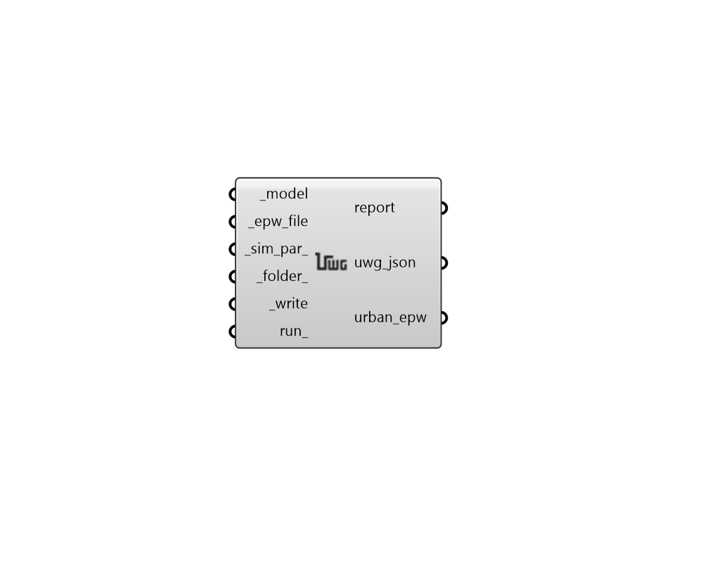

## Run Urban Weather Generator

 - [[source code]](https://github.com/ladybug-tools/dragonfly-grasshopper/blob/master/dragonfly_grasshopper/src//DF%20Run%20Urban%20Weather%20Generator.py)

Morph a rural or airport EPW to reflect the conditions within an urban street canyon. The properties of this urban street canyon are specified in the connected _model. 

For definitions of the inputs of the Urban Weather Generator, please see the UWG schema documentation (https://www.ladybug.tools/uwg-schema/index.html). 

For a full list of publications on the Urban Weather Generator, see the MIT Urban Microclimate Group (http://urbanmicroclimate.scripts.mit.edu/publications.php). 

#### Inputs
* ##### model [Required]
A Dragonfly Model to be used to morph the EPW for the urban area. 
* ##### epw_file [Required]
Full path to an .epw file. This is the rural or airport file that will be morphed to reflect the climate conditions within an urban canyon. 
* ##### sim_par 
A dragonfly UWG SimulationParameter object that describes all of the setting for the simulation. If None, some default simulation parameters will be used. 
* ##### folder 
File path for the directory into which the the uwg JSON and morphed urban EPW will be written. If None, it will be written into the ladybug default_epw_folder within a subfolder bearing the name of the dragonfly Model. 
* ##### write [Required]
Set to "True" to generate a UWG JSON from the connected _model and parameters. This JSON can be edited and simulated by the UWG directly. 
* ##### run 
Set to "True" to simulate the uwg_json with the Urban Weather Generator (UWG) and morph the input EPW to account for urban heat island. This can also be the integer "2", which will run the UWG silently (without any batch windows). 

#### Outputs
* ##### report
Reports, errors, warnings, etc. 
* ##### uwg_json
Path to a fully-simulatable JSON file following the UWG schema. This contains all of the relevant Dragonfly Model properties and input parameters. 
* ##### urban_epw
Path to the morphed EPW file output from the UWG, which represents urban heat island conditions within the street canyon. 