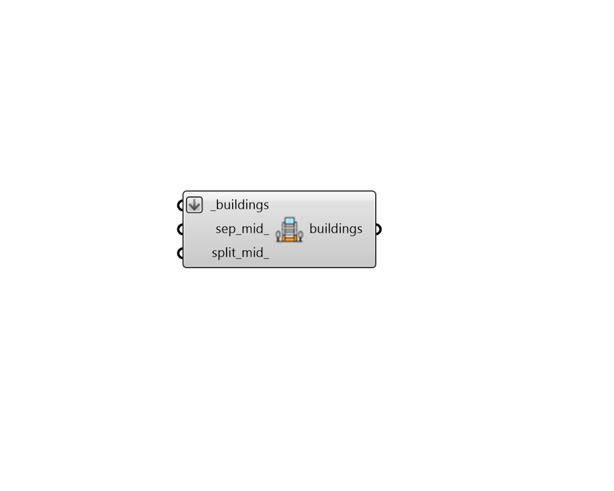

## Separate Top Bottom

 - [[source code]](https://github.com/ladybug-tools/dragonfly-grasshopper/blob/master/dragonfly_grasshopper/src//DF%20Separate%20Top%20Bottom.py)

Separate the top and bottom floors of a Building into unique Stories with a multiplier of 1 and automatically assign the first story Room2Ds to have a ground contact floor and the top story Room2Ds to have an outdoor-exposed roof. 

This is particularly helpful when trying to account for the heat exchange of the top or bottom floors with the gound or outdoors. 

The "mid" options can also be used to separate the middle floors and account for heat flow through exposed roofs of middle floors. 

#### Inputs
* ##### buildings [Required]
Dragonfly Building objects which will have their top and bottom stories separated into unique ones with a multiplier of 1. This can also be an entire Dragonfly Model. 
* ##### sep_mid 
Boolean to note whether all mid-level Stories with non-unity multipliers should be separated into two or three Stories. This means that the top of each unique story will have outdoor-exposed roofs when no Room2Ds are sensed above a given room. (Default: False). 
* ##### split_mid 
Boolean to note whether all mid-level Stories should be split with the Story above in order to set outdoor-exposed roofs with correct areas. This is useful when the Story footprints vary a lot as one moves up the building. An attempt will be made to re-assign properties to the walls of the rooms but some loss of properties like windows is to be expected and may need to be re-assigned. Adjacencies between Room2Ds will be automatically re-solved. This input will have no effect when sep_mid_ is False or unspecified. (Default: False). 

#### Outputs
* ##### buildings
The Building objects with their top and bottom floors separated. 