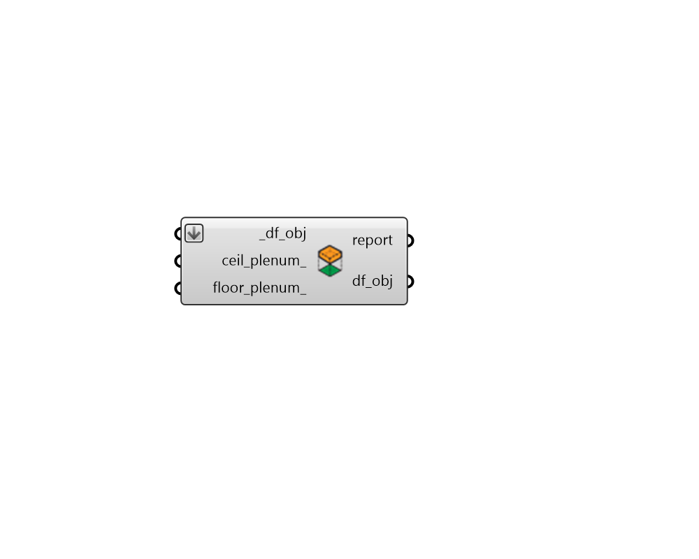

## Set Plenums

 - [[source code]](https://github.com/ladybug-tools/dragonfly-grasshopper/blob/master/dragonfly_grasshopper/src//DF%20Set%20Plenums.py)

Set the ceiling plenum and/or floor plenum depth of rooms for any Dragonfly object (Room2Ds, Stories, Buildings, Model). 

#### Inputs
* ##### df_obj [Required]
A Dragonfly Model, Building, Story or Room2D to have plenum depths assigned to it. 
* ##### ceil_plenum 
A number for the depth that ceiling plenums extend into rooms. Setting this to a positive value will result in a separate plenum room being split off of the Room2D volume during translation from Dragonfly to Honeybee. 
* ##### floor_plenum 
A number for the depth that floor plenums extend into rooms. Setting this to a positive value will result in a separate plenum room being split off of the Room2D volume during translation from Dragonfly to Honeybee. 

#### Outputs
* ##### report
Reports, errors, warnings, etc. 
* ##### df_obj
The input Dragonfly object with ceiling or floor plenum depths set. 