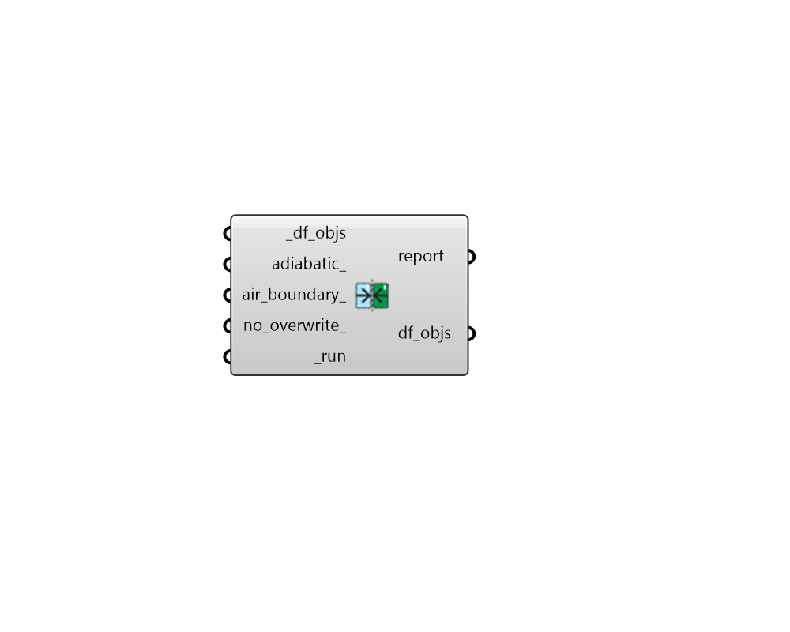

## Solve Adjacency

 - [[source code]](https://github.com/ladybug-tools/dragonfly-grasshopper/blob/master/dragonfly_grasshopper/src//DF%20Solve%20Adjacency.py)

Solve adjacencies between a series of dragonfly Room2Ds. 

Note that rooms must have matching edge segments in order for them to be discovered as adjacent. The "DF Intersect Room2Ds" component can be used to ensure adjacent rooms have matching segments. 

#### Inputs
* ##### room2ds [Required]
A list of dragonfly Room2Ds for which adjacencies will be solved. 
* ##### adiabatic 
Set to True to have all of the adjacencies discovered by this component set to an adiabatic boundary condition. If False, a Surface boundary condition will be used for all adjacencies. Note that adabatic conditions are not allowed if interior windows are assigned to interior walls. (Default: False). 
* ##### air_boundary 
Set to True to have all of the wall adjacencies discovered by this component set to an AirBoundary type. Note that AirBoundary types are not allowed if interior windows are assigned to interior walls. (Default: False). 
* ##### run [Required]
Set to True to run the component and solve adjacencies. 

#### Outputs
* ##### report
Reports, errors, warnings, etc. 
* ##### adj_room2ds
The input Room2Ds but with adjacencies solved for between segments. 