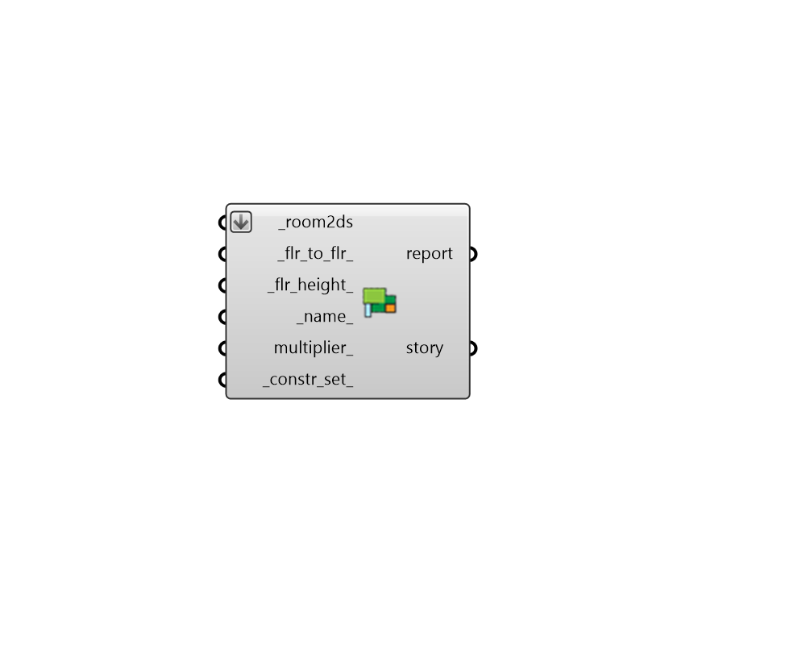

## Story

 - [[source code]](https://github.com/ladybug-tools/dragonfly-grasshopper/blob/master/dragonfly_grasshopper/src//DF%20Story.py)

Create a Dragonfly Story from individual Dragonfly Room2D objects. 

#### Inputs
* ##### room2ds [Required]
A list of Dragonfly Story objects to be joined into one Building. 
* ##### flr_to_flr 
A number for the distance from the floor plate of this Story to the floor of the story above this one (if it exists). If None, this value will be the maximum floor_to_ceiling_height of the input _room_2ds. 
* ##### flr_height 
A number for the absolute floor height of the Story. If None, this will be the minimum floor height of all the Story's room_2ds, which is suitable for cases where there are no floor plenums. (Default: None). 
* ##### name 
Text to set the name for the Story, which will also be incorporated into unique Story identifier. If the name is not provided a random one will be assigned. 
* ##### multiplier 
An integer with that denotes the number of times that this Story is repeated over the height of the building. Default: 1. 
* ##### constr_set 
Text for the construction set of the Story, which is used to assign all default energy constructions needed to create an energy model. Text should refer to a ConstructionSet within the library such as that output from the "HB List Construction Sets" component. This can also be a custom ConstructionSet object. If nothing is input here, the Story will have a generic construction set that is not sensitive to the Story's climate or building energy code. 

#### Outputs
* ##### report
Reports, errors, warnings, etc. 
* ##### story
Dragonfly Building. 