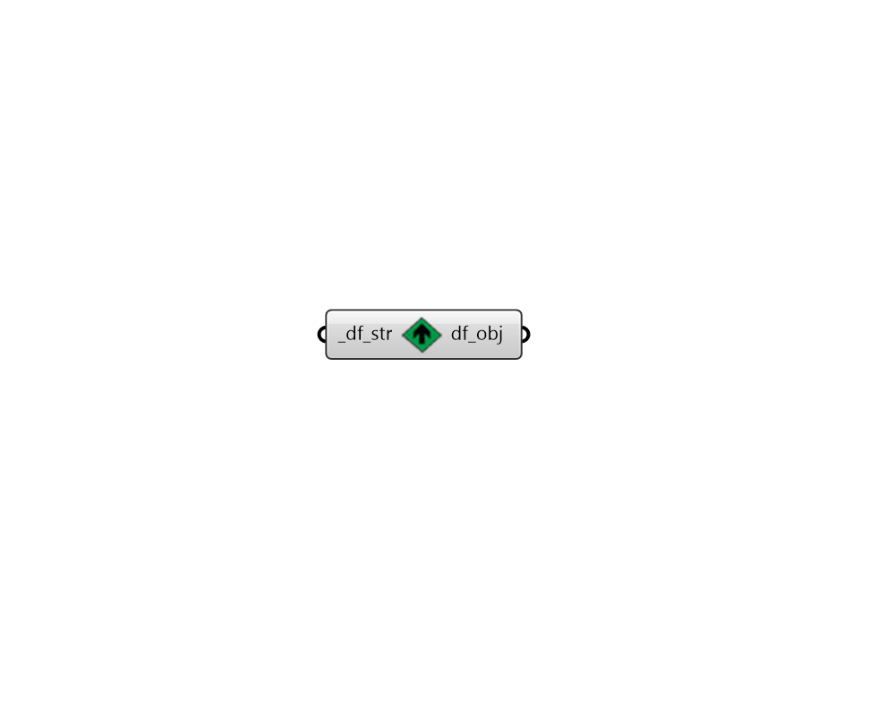

## String to Object

 - [[source code]](https://github.com/ladybug-tools/dragonfly-grasshopper/blob/master/dragonfly_grasshopper/src//DF%20String%20to%20Object.py)

Serialize any dragonfly JSON text string back to a dragonfly object. 

This includes any Model, Building, Story, Room2D, WindowParameter, or ShadingParameter. 

It also includes any dragonfly energy Material, Construction, ConstructionSet, Schedule, Load, ProgramType, or Simulation object. 

#### Inputs
* ##### df_str [Required]
A text string that completely describes the dragonfly object. 

#### Outputs
* ##### df_obj
A Dragonfly object serialized from the input string. 