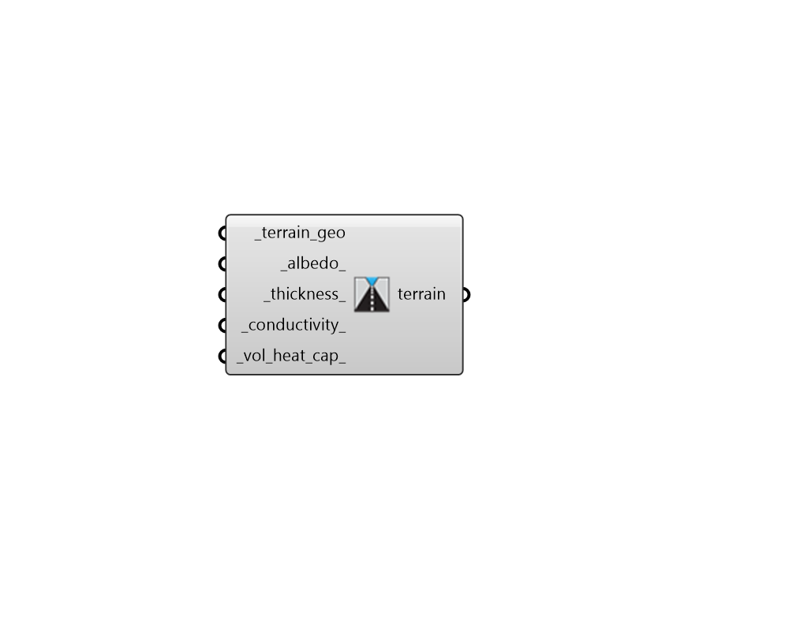

## Terrain

 - [[source code]](https://github.com/ladybug-tools/dragonfly-grasshopper/blob/master/dragonfly_grasshopper/src//DF%20Terrain.py)

Create a Terrain object representing the land on which an urban area sits. 

This includes both the geometry and the properties of the pavement within the urban area. 

#### Inputs
* ##### terrain_geo [Required]
An array of Breps or meshes that together represent the terrian. This should include the entire area of the site, including that beneath building footprints. 
* ##### albedo 
A number between 0 and 1 that represents the albedo (reflectivity) of the pavement. (Default: 0.1, typical of fresh asphalt). 
* ##### thickness 
A number that represents the thickness of the pavement material in meters. (Default: 0.5 meters). 
* ##### conductivity 
A number representing the conductivity of the pavement material in W/m-K. (Default: 1 W/m-K, typical of asphalt). 
* ##### vol_heat_cap 
A number representing the volumetric heat capacity of the pavement material in J/m3-K. This is the number of joules needed to raise one cubic meter of the material by 1 degree Kelvin. (Default: 1.6e6 J/m3-K, typical of asphalt). 

#### Outputs
* ##### terrain
A Terrain object that can be plugged into the "DF Assign Model UWG Properties" component to specify the terrain of an urban area. 