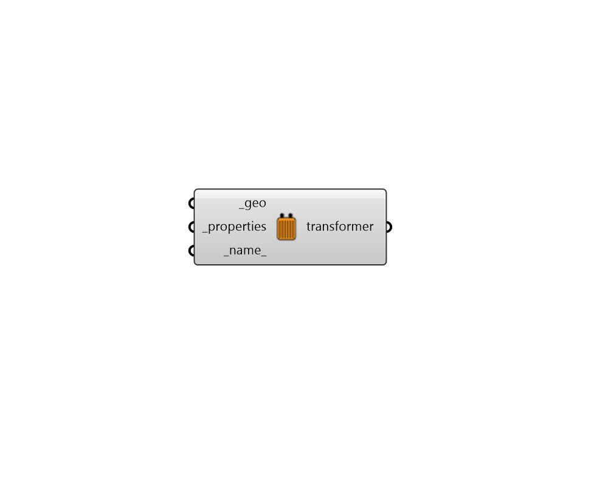

## Transformer

 - [[source code]](https://github.com/ladybug-tools/dragonfly-grasshopper/blob/master/dragonfly_grasshopper/src//DF%20Transformer.py)

Create an OpenDSS Transformer from its footprint geometry (horizontal Rhino surfaces). 

#### Inputs
* ##### geo [Required]
A horizontal Rhino surface representing a footprint to be converted into a Transformer. 
* ##### properties [Required]
Text for the properties of the Transformer to be looked up in the TransformerProperties library (the output from the "DF OpenDSS Libraries" component). This can also be a custom TransformerProperties object. 
* ##### name 
Text to set the base name for the Transformer, which will also be incorporated into unique Transformer identifier. If the name is not provided, a random one will be assigned. 

#### Outputs
* ##### transformer
A Dragonfly Transformer object that can be used within an Electrical Network. 