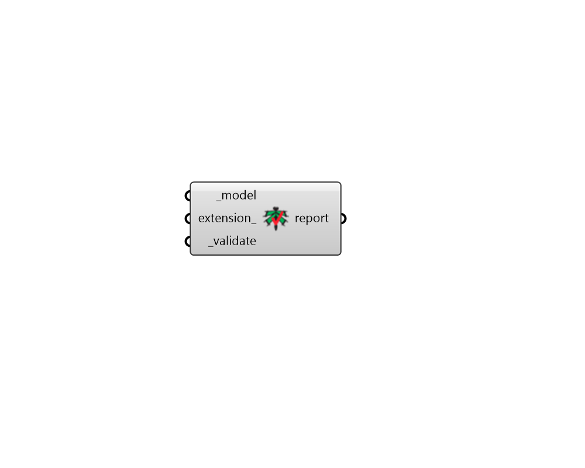

## Validate Model

 - [[source code]](https://github.com/ladybug-tools/dragonfly-grasshopper/blob/master/dragonfly_grasshopper/src//DF%20Validate%20Model.py)

Get a validation report that contains a summary of all issues with the Model. 

This includes basic properties like adjacency checks and all geometry checks. Furthermore, extension attributes for Energy and Radiance can be checked to ensure that the model can be simulated correctly in these engines. 

#### Inputs
* ##### model [Required]
A Dragonfly Model object to be validated. This can also be the file path to a Model DFJSON that will be validated. 
* ##### extension 
Optional text for the name of the dragonfly extension for which validation will occur. The value input here is case-insensitive such that "radiance" and "Radiance" will both result in the model being checked for validity with dragonfly-radiance. This value can also be set to "Generic" in order to run checks for all installed extensions. Using "Generic" will run all except the most limiting of checks (like DOE2's lack of support for courtyards) with the goal of producing a model that is export-able to multiple engines (albeit with a little extra postprocessing for particularly limited engines). Some common dragonfly extension names that can be input here if they are installed include the following. (Default: Generic). 

    * Radiance

    * EnergyPlus

    * OpenStudio

    * DOE2
* ##### validate [Required]
Set to "True" to validate the the Model and get a report of all issues with the model. 

#### Outputs
* ##### report
A report summarizing any issues with the input _model. If anything is invalid about the input model, this component will give a warning and this report will contain information about the specific parts of the model that are invalid. Otherwise, this report will simply say that the input model is valid. 