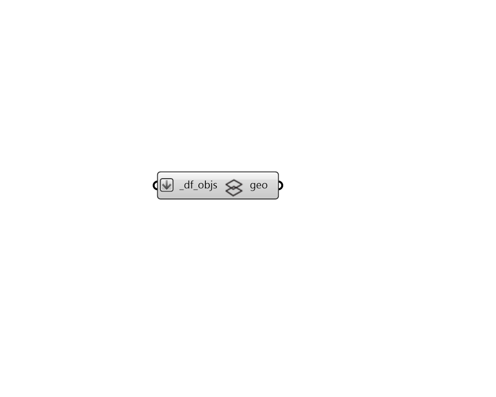

## Visualize Wireframe

 - [[source code]](https://github.com/ladybug-tools/dragonfly-grasshopper/blob/master/dragonfly_grasshopper/src//DF%20Visualize%20Wireframe.py)

Quickly preview any Dragonfly geometry object as a wire frame within the Rhino scene, including all stories represented by multipliers 

#### Inputs
* ##### df_objs [Required]
A Dragonfly Model, Building, Story, Room2D, or ContextShade to be previewed as a wire frame in the Rhino scene. 

#### Outputs
* ##### geo
The Rhino version of the Dragonfly geometry object, which will be visible in the Rhino scene. 