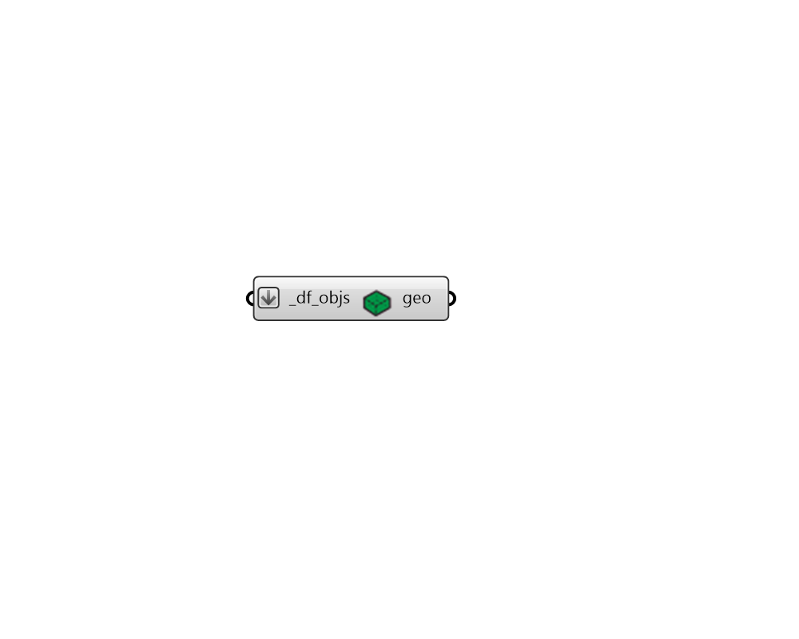

## Vizualize Quick

 - [[source code]](https://github.com/ladybug-tools/dragonfly-grasshopper/blob/master/dragonfly_grasshopper/src//DF%20Vizualize%20Quick.py)

Quickly preview any Dragonfly geometry object within the Rhino scene. 

Any stories represented by multipliers will not be included in the output, allowing for a faster preview of large lists of objects but without the ability to check the multipliers of objects. 

#### Inputs
* ##### df_objs [Required]
A Dragonfly Model, Building, Story, Room2D, or ContextShade to be previewed in the Rhino scene. 

#### Outputs
* ##### geo
The Rhino version of the Dragonfly geometry object, which will be visible in the Rhino scene. 