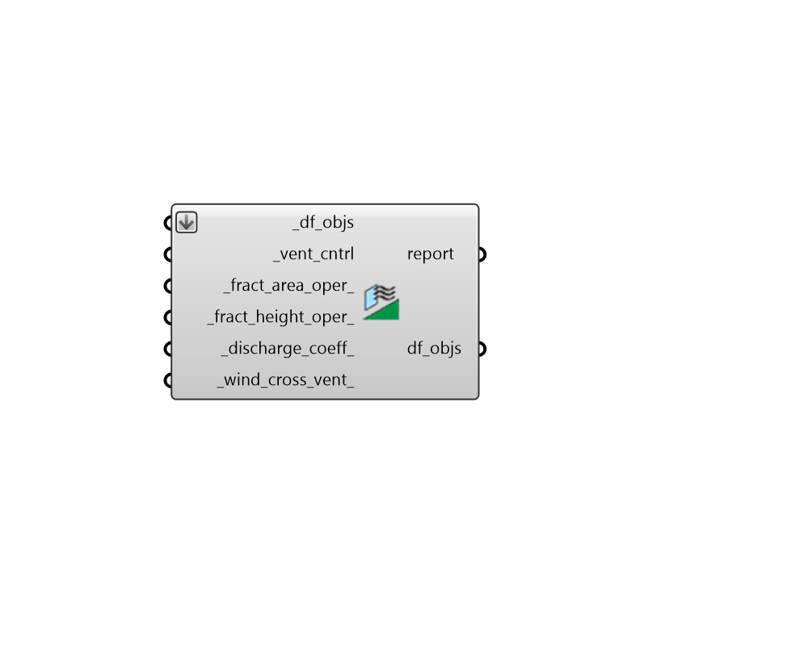

## Window Opening

 - [[source code]](https://github.com/ladybug-tools/dragonfly-grasshopper/blob/master/dragonfly_grasshopper/src//DF%20Window%20Opening.py)

Define the window opening properties for all apertures of a Dragonfly Building, Story or Room2D. 

#### Inputs
* ##### df_objs [Required]
Dragonfly Buildings, Stories or Room2Ds to which window ventilation opening properties will be assigned. Note that this component assigns such properties to all Outdoor Apertures on the rooms. 
* ##### vent_cntrl [Required]
A Ventilation Control object from the "HB Ventilation Control" component, which dictates the opening behaviour of the Room's apertures. 
* ##### fract_area_oper 
A number between 0.0 and 1.0 for the fraction of the window area that is operable. (Default: 0.5, typical of sliding windows). 
* ##### fract_height_oper 
A number between 0.0 and 1.0 for the fraction of the distance from the bottom of the window to the top that is operable. (Default: 1.0, typical of windows that slide horizontally). 
* ##### discharge_coeff 
A number between 0.0 and 1.0 that will be multipled by the area of the window in the stack (buoyancy-driven) part of the equation to account for additional friction from window geometry, insect screens, etc. (Default: 0.45, for unobstructed windows with insect screens). This value should be lowered if windows are of an awning or casement type and not allowed to fully open. Some common values for this coefficient include the following. 

    * 0.0 - Completely discount stack ventilation from the calculation.

    * 0.45 - For unobstructed windows with an insect screen.

    * 0.65 - For unobstructed windows with NO insect screen.
* ##### wind_cross_vent 
Boolean to indicate if there is an opening of roughly equal area on the opposite side of the Room such that wind-driven cross ventilation will be induced. If False, the assumption is that the operable area is primarily on one side of the Room and there is no wind-driven ventilation. (Default: False) 

#### Outputs
* ##### report
... 
* ##### df_objs
The input Dragonfly object with their window-opening properties edited. 