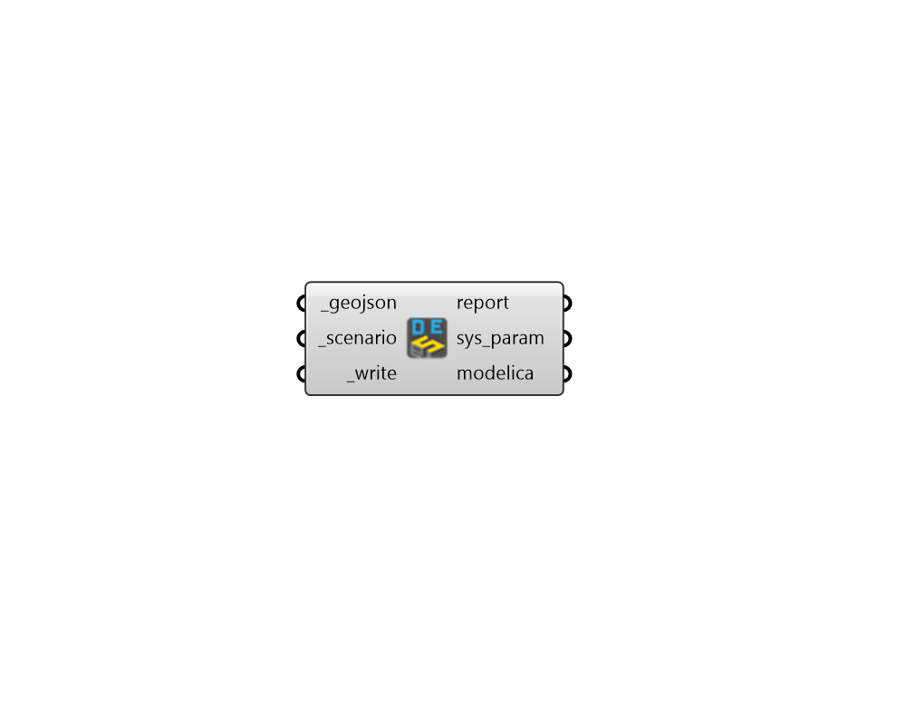

## Write Modelica DES

 - [[source code]](https://github.com/ladybug-tools/dragonfly-grasshopper/blob/master/dragonfly_grasshopper/src//DF%20Write%20Modelica%20DES.py)

Use an URBANopt geoJSON with a Distric Energy System (DES) loop assigned to it along with the corresponding scenario (containing building loads) to generate a Modelica model of the district system. 

The model is generated using the modules of the Modelica Buildings Library (MBL). More information on the MBL can be found here: https://simulationresearch.lbl.gov/modelica/ 

The Modelica model produced by this component can be opened and edited in any of the standard Modelica interfaces (eg. Dymola) or it can be simulated with OpenModelica inside a Docker image using the "DF Run Modelica" component. 

#### Inputs
* ##### geojson [Required]
The path to an URBANopt-compatible geoJSON file. This geoJSON file can be obtained form the "DF Model to geoJSON" component. Note that the geoJSON must have a valid District Energy System (DES) Loop assigned to it in order to run correctly with this component. 
* ##### scenario [Required]
The path to an URBANopt .csv file for the scenario. This CSV file can be obtained form the "DF Run URBANopt" component. 
* ##### write [Required]
Set to "True" to run the component, install any missing dependencies, and write the Modelica files for the Distric Energy System. 

#### Outputs
* ##### report
Reports, errors, warnings, etc. 
* ##### sys_param
A JSON file containing all of the specifications of the District Energy System, including the detailed Building load profiles, equipment specifications, borehole field characteristics (if applicable), etc. 
* ##### modelica
A folder where all of the Modelica files of the District Energy System (DES) are written. 